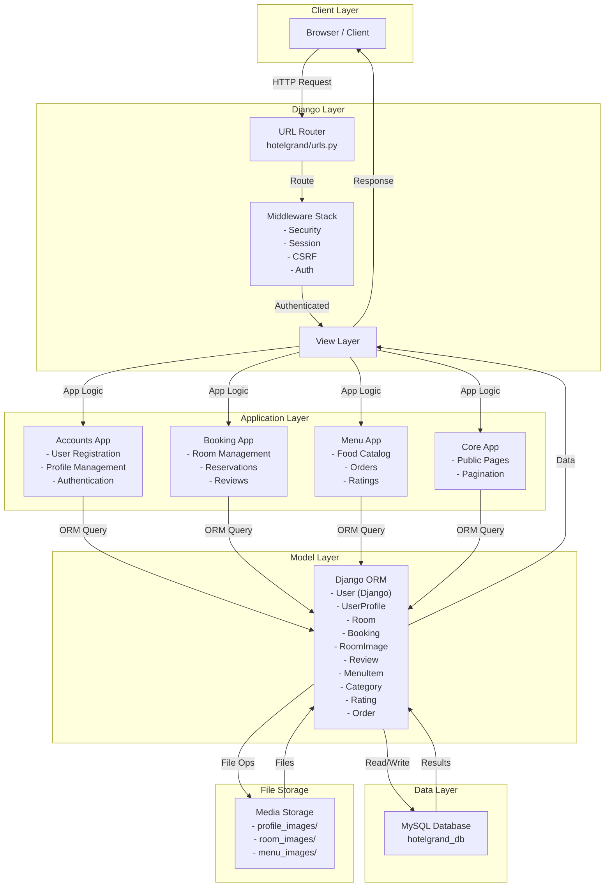
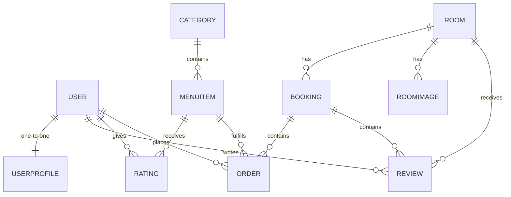

# Hotel Grand - System Architecture Documentation

## Overview

Hotel Grand is a Django-based hotel management system that handles room bookings, guest profiles, food ordering, and reviews. The system is organized into four main modules with a shared configuration layer.

## System Architecture

### Architecture Diagram



## Module Structure

### 1. **Accounts Module** (`accounts/`)

**Responsibility:** User authentication and profile management

**Key Components:**

- `models.py` - UserProfile model extending Django User
- `views.py` - Registration, login, profile updates
- `forms.py` - ProfileEditForm for profile editing
- `urls.py` - Account routing

**Key Features:**

- User registration with validation
- Profile image upload
- Role-based access (customer/worker)
- Loyalty points tracking
- Personal details management (DOB, phone, address)
- Profile completion tracking

**Dependencies:**

- Django auth system
- UserProfile model

---

### 2. **Booking Module** (`booking/`)

**Responsibility:** Room management and reservation system

**Key Components:**

- `models.py` - Room, Booking, RoomImage, Review models
- `views.py` - Booking operations, availability checking, reviews
- `forms.py` - PrivateBookingForm, AvailabilityForm
- `urls.py` - Booking routing

**Key Features:**

- Room catalog with amenities and pricing
- Multi-image support per room
- Availability checking with conflict detection
- Booking lifecycle management (pending → confirmed → checked_in → completed)
- Guest reviews with ratings
- Booking extension functionality
- Dynamic pricing calculation

**Dependencies:**

- Room, Booking, Review, RoomImage models
- Booking validation forms

---

### 3. **Menu Module** (`menu/`)

**Responsibility:** Food service and ordering system

**Key Components:**

- `models.py` - MenuItem, Category, Rating, Order models
- `views.py` - Menu display, order placement
- `urls.py` - Menu routing

**Key Features:**

- Food items organized by category
- Item ratings and average calculations
- In-room food ordering for checked-in guests
- Order status tracking (pending → preparing → delivered)
- Loyalty points per item
- Image support for menu items

**Dependencies:**

- MenuItem, Category, Rating, Order models
- Booking status (must be checked_in to order)

---

### 4. **Core Module** (`core/`)

**Responsibility:** Public-facing pages and utilities

**Key Components:**

- `views.py` - Home, about, public booking/menu pages
- `models.py` - Empty (placeholder)

**Key Features:**

- Home and about pages
- Public room catalog (paginated, 9 per page)
- Public menu display (paginated, 3 per page)
- Category-based menu filtering
- No authentication required

**Dependencies:**

- Room, MenuItem, Category models

---

### 5. **Configuration Layer** (`hotelgrand/`)

**Responsibility:** Django project configuration

**Key Components:**

- `settings.py` - Django settings, database config, apps, middleware
- `urls.py` - Main URL dispatcher
- `wsgi.py` - WSGI application entry point

**Configuration:**

- MySQL database: `hotelgrand_db`
- 7 middleware components
- 4 custom apps + 6 Django apps
- Template directories
- Static/media file handling

---

## Data Model Relationships



## Request/Response Flow

### User Registration & Authentication

```
1. User → GET /accounts/register/ → Show registration form
2. User → POST /accounts/register/ → Create User & UserProfile
3. User → GET /accounts/login/ → Show login form
4. User → POST /accounts/login/ → Django auth, create session
5. User → GET /book/private/ → Protected, requires login
```

### Room Booking Flow

```
1. User → GET /rooms/ → Core.public_booking → List all rooms (paginated)
2. User → POST /book/check/ → Check availability for dates
3. User → POST /book/private/ → Create booking if no conflicts
4. Booking.save() → Auto-calculate total_price
5. User → GET /book/booking/success/ → Confirmation
```

### Food Ordering Flow

```
1. Guest (checked_in) → GET /menu/private-menu/ → Show available food
2. Guest → POST /menu/place-order/ → Create Order
3. Order status: pending → preparing → delivered
```

### Room Review Flow

```
1. Guest → GET /book/room/<id>/ → View room details & reviews
2. Guest → POST /book/submit-review/ → Create review (requires checked-in status)
3. Review displayed on room detail page
```

## Security Features

### Authentication & Authorization

- Django's built-in authentication system
- login_required decorators protect sensitive views
- Role-based access (customer vs. worker via UserProfile.role)
- Session-based authentication

### CSRF Protection

- CsrfViewMiddleware in middleware stack
-  in all forms
- csrf_exempt decorator on AJAX endpoints (intentional)

### Password Security

- Django's password hashing (PBKDF2 by default)
- Password validation on registration
- update_session_auth_hash() prevents logout on password change

### Data Validation

- Form validation at model and form levels
- URL parameter type checking (e.g., `<int:room_id>`)
- Booking conflict detection before creation

## Deployment Considerations

### Development Settings

- DEBUG = True (security risk in production)
- SECRET_KEY = 'insecure...' (must be changed)
- ALLOWED_HOSTS = [] (must specify domains)

### Production Recommendations

- Set DEBUG = False
- Use environment variables for SECRET_KEY
- Configure ALLOWED_HOSTS with actual domains
- Use dedicated static/media file server
- Enable HTTPS/SSL
- Use environment-based database credentials
- Consider adding:
  - Django-cors-headers for CORS
  - Rate limiting (django-ratelimit)
  - Caching (redis/memcached)

## Database Schema

**User Management:**

- User (Django built-in)
- UserProfile (extends User)

**Room Management:**

- Room
- RoomImage
- Booking
- Review

**Food Service:**

- Category
- MenuItem
- Rating
- Order

**See individual model documentation for field details**

## File Storage Structure

```
media/
├── profile_images/
│   └── [user profile pictures]
├── room_images/
│   └── [room photos]
└── menu_images/
    └── [menu item pictures]

templates/
├── accounts/
│   └── [user account templates]
├── admin/
│   └── [admin dashboard templates]
├── customer/
│   └── [customer-facing templates]
├── public/
│   └── [public-facing templates]
├── worker/
│   └── [worker-facing templates]
└── shared/
    └── [shared templates]
```

## Middleware Stack Order

1. **SecurityMiddleware** - Sets security headers (X-Frame-Options, etc.)
2. **SessionMiddleware** - Session support
3. **CommonMiddleware** - Common utilities (URL normalization, etc.)
4. **CsrfViewMiddleware** - CSRF token validation
5. **AuthenticationMiddleware** - request.user population
6. **MessageMiddleware** - Message framework support
7. **XFrameOptionsMiddleware** - Clickjacking protection

## Development Workflow

### Setting Up Locally

```bash
# Create database
mysql -u root -p
CREATE DATABASE hotelgrand_db;
CREATE USER django_user IDENTIFIED BY 'secure_password';
GRANT ALL ON hotelgrand_db.* TO django_user;

# Run migrations
python manage.py migrate

# Create superuser
python manage.py createsuperuser

# Load initial data (if fixtures exist)
python manage.py loaddata [fixture_name]

# Start development server
python manage.py runserver
```

### Creating Models & Migrations

```bash
# Make changes to models.py
python manage.py makemigrations [app_name]
python manage.py migrate

# Check SQL
python manage.py sqlmigrate [app_name] [migration_number]
```

### Testing

```bash
python manage.py test [app_name]
python manage.py test [app_name].[ModelName]
```

## API Endpoints Summary

### Public Endpoints

- `GET /` - Home
- `GET /about/` - About
- `GET /rooms/` - Browse rooms
- `GET /menu/` - Browse menu

### Authentication

- `GET/POST /login/` - Login
- `GET /logout/` - Logout
- `POST /accounts/register/` - Register

### User Account (Authenticated)

- `GET/POST /accounts/edit/` - Edit profile
- `POST /accounts/update/username/` - Update username
- `POST /accounts/update/email/` - Update email
- `POST /accounts/update/photo/` - Upload profile picture
- `POST /accounts/update/password/` - Change password
- `POST /accounts/update/details/` - Update personal info

### Booking (Authenticated)

- `GET/POST /book/private/` - Private booking with availability filter
- `GET/POST /book/check/` - Check availability
- `GET /book/booking/success/` - Booking confirmation
- `GET /book/room/<id>/` - Room details & reviews
- `POST /book/extend-booking/` - Extend booking
- `POST /book/submit-review/` - Submit room review

### Menu (Authenticated, Checked-in)

- `GET /menu/private-menu/` - Private menu
- `POST /menu/place-order/` - Place food order

## System Constraints & Limitations

1. **Single Database:** Uses single MySQL instance (no replication)
2. **No API:** REST API not implemented (web only)
3. **No Async:** No background tasks (Celery not configured)
4. **No Caching:** No caching layer (all queries hit database)
5. **Simple Auth:** No OAuth, two-factor auth, or social login
6. **File Storage:** Local filesystem only (no cloud storage)
7. **Rating System:** No duplicate rating prevention at model level
8. **Booking Status:** Manual status updates (no automatic state machines)
9. **Pricing:** Static per-room pricing (no dynamic pricing)

## Future Enhancement Opportunities

1. Add REST API for mobile apps
2. Implement async task queue (Celery)
3. Add caching layer (Redis)
4. Implement payment processing
5. Add email notifications
6. Implement rating uniqueness constraint
7. Add admin dashboard for worker operations
8. Implement date range pricing
9. Add room availability calendar
10. Implement real-time notifications
