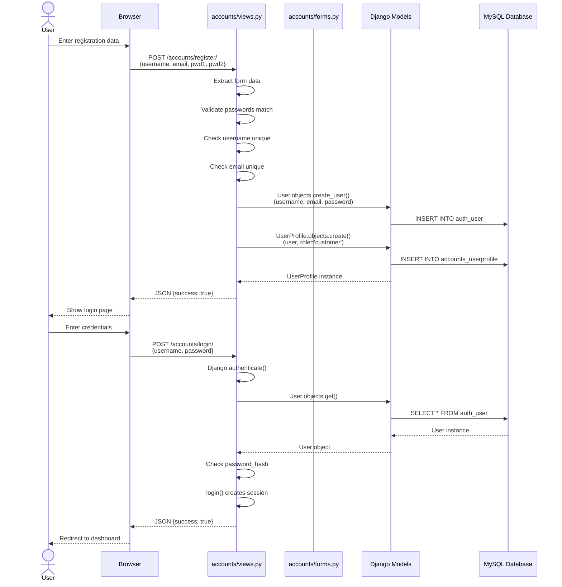
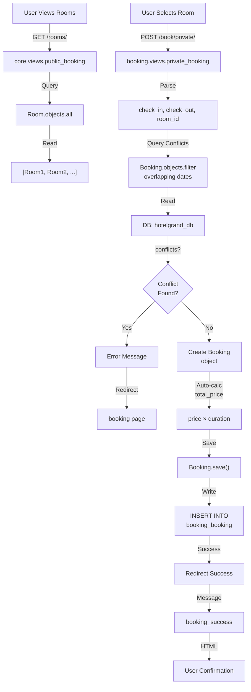
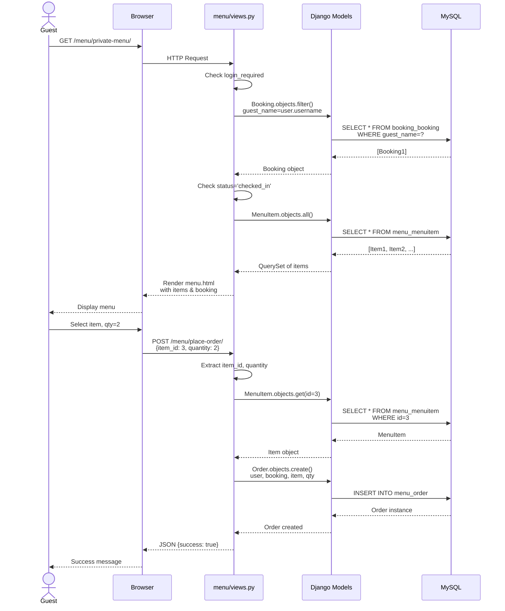
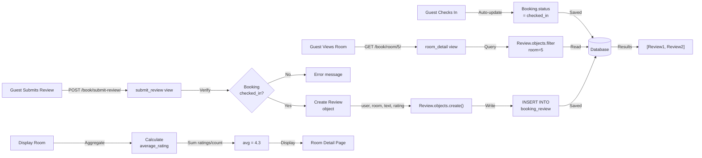
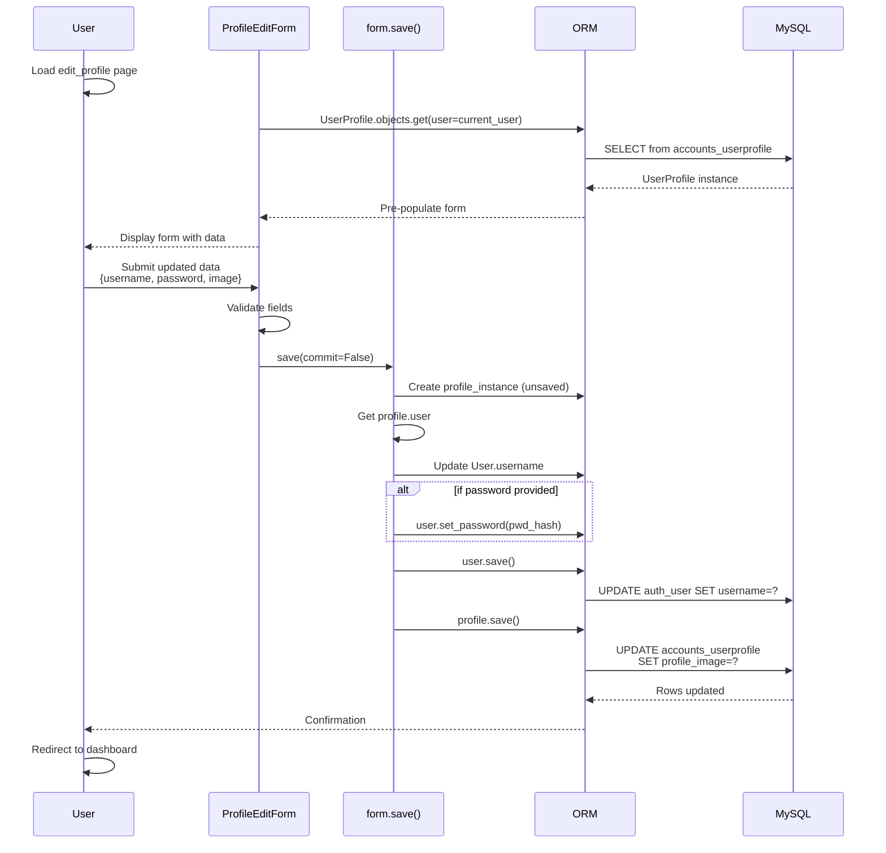
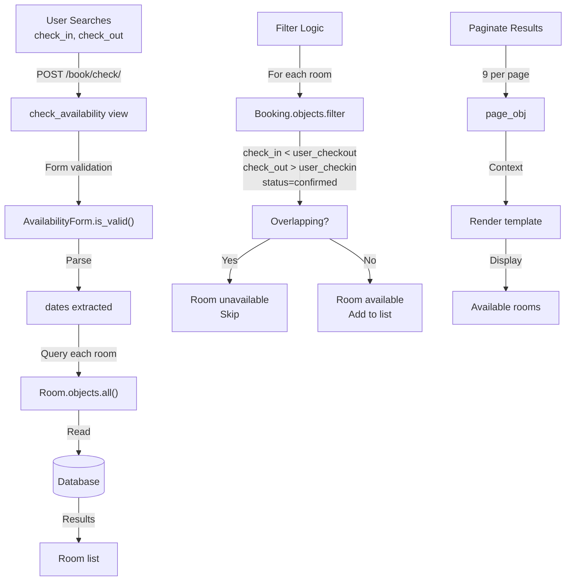

# Data Flow Documentation

## Overview

This document describes the end-to-end data flow across all major system operations in Hotel Grand. It traces how data moves through the application layers from user input to database persistence and back to display.

## Complete Data Flow Diagrams

### 1. User Registration & Authentication Flow



### 2. Room Booking Flow



### 3. Food Order Flow



### 4. Room Review & Rating Flow



### 5. Profile Update Flow



### 6. Availability Check Flow



## Data Input/Output by Module

### Accounts Module

**Inputs:**
```
Registration:
  - username (string, required)
  - email (string, required)
  - password1 (string, required)
  - password2 (string, required)

Login:
  - username (string, required)
  - password (string, required)

Profile Edit:
  - username (string, optional)
  - password (string, optional)
  - profile_image (file, optional)
  - dob (date, optional)
  - phone (string, optional)
  - address (text, optional)
```

**Outputs:**
```
Stored in Database:
  - User record (auth_user table)
  - UserProfile record (accounts_userprofile table)
  - Profile image file (media/profile_images/)
  - Session cookie (for authentication)
```

**Database Operations:**
```
CREATE: User, UserProfile, Profile images
READ: User authentication, profile retrieval
UPDATE: Username, email, password, profile fields
DELETE: User and profile (cascade)
```

---

### Booking Module

**Inputs:**
```
Booking:
  - room_id (integer)
  - check_in (datetime)
  - check_out (datetime)
  - guest_count (integer)
  - special_requests (text, optional)

Availability:
  - check_in (date)
  - check_out (date)

Review:
  - room_id (integer)
  - text (text)
  - rating (integer 1-5, optional)
```

**Outputs:**
```
Stored in Database:
  - Booking record with:
    - status (pending/confirmed/checked_in/completed)
    - total_price (auto-calculated)
  - Review record linked to booking
  - Room images stored in media/room_images/

Display Data:
  - Available rooms list (paginated)
  - Room details with images & reviews
  - Average ratings calculated from reviews
```

**Database Operations:**
```
CREATE: Booking, Review, RoomImage
READ: Room details, availability checking, reviews
UPDATE: Booking status, total_price recalculation, booking extension
DELETE: Bookings, reviews (with cascade)
```

**Price Calculation:**
```
total_price = room.price × max(days_between_dates, 1)
- Handles fractional days via Decimal precision
- Recalculated on each booking.save()
```

---

### Menu Module

**Inputs:**
```
Order:
  - item_id (integer)
  - quantity (integer)
  - [user_id, booking_id auto-populated from session]

Rating:
  - menu_item_id (integer)
  - value (integer 1-5)
  - [user_id auto-populated from session]
```

**Outputs:**
```
Stored in Database:
  - Order record with:
    - status (pending/preparing/delivered)
    - ordered_at (auto timestamp)
  - Rating record
  - Menu images in media/menu_images/

Display Data:
  - Menu items with:
    - Average rating (calculated on-demand)
    - Category grouping
    - Price and details
```

**Database Operations:**
```
CREATE: Order, Rating
READ: MenuItem, Category, Order history
UPDATE: Order status, MenuItem rating aggregation
DELETE: Orders, ratings (with cascade)
```

**Rating Aggregation:**
```
average_rating = Sum(all_ratings) / Count(all_ratings)
- Calculated on each access (no caching)
- Returns 0 if no ratings exist
- Rounded to 1 decimal place
```

---

### Core Module

**Inputs:**
```
GET parameters:
  - page (optional, for pagination)
```

**Outputs:**
```
Display Data:
  - Home page (static template)
  - About page (static template)
  - Public room catalog (paginated, 9/page)
  - Public menu (paginated, 3/page)
  - Category list for menu
```

**Database Operations:**
```
READ: Room.objects.all()
      MenuItem.objects.all()
      Category.objects.prefetch_related('items')
      (No writes)
```

---

## Request/Response Cycle with Data

### Complete HTTP Request Example

**Request: User Books Room**
```http
POST /book/private/ HTTP/1.1
Host: hotelgrand.local
Content-Type: application/x-www-form-urlencoded
Cookie: sessionid=abc123xyz

room_id=5&check_in=2024-03-15T15:00&check_out=2024-03-18T11:00&guest_count=2&special_requests=Late+checkout
```

**Data Processing:**
```
1. URL Router matches /book/private/ → booking.views.private_booking
2. Middleware chain:
   - Session: Load session, get request.user
   - Auth: Populate request.user with authenticated User
   - CSRF: Validate CSRF token
3. View extracts POST data:
   - room_id = 5
   - check_in = datetime(2024, 3, 15, 15, 0)
   - check_out = datetime(2024, 3, 18, 11, 0)
   - guest_count = 2
4. Query: SELECT * FROM booking_booking WHERE room_id=5 AND ... (overlap check)
5. Calculate: total_price = 150.00 * 3 days = 450.00
6. Create: INSERT INTO booking_booking (room_id, guest_name, check_in, check_out, total_price, status)
7. Response: Redirect to /book/booking/success/
```

**Response:**
```http
HTTP/1.1 302 Found
Location: /book/booking/success/
Set-Cookie: messages=...
```

### Complete Database Example

**Tables Involved in Booking:**
```
auth_user
├── id, username, email, password, ...
└── Used for: User authentication

accounts_userprofile
├── id, user_id (FK), role, loyalty_points, ...
└── Used for: Profile details

booking_room
├── id, name, price, capacity, ...
└── Used for: Room details, pricing

booking_booking
├── id, room_id (FK), guest_name, check_in, check_out, total_price, status, ...
└── Used for: Reservation tracking

booking_review
├── id, room_id (FK), user_id (FK), text, rating, ...
└── Used for: Guest feedback
```

**Sample Data Flow:**
```
User Request → Load Room (booking_room) → Check conflicts (query booking_booking)
            → Calculate price
            → Insert new Booking (booking_booking)
            → Commit transaction
            → Return confirmation
```

## Caching & Performance Considerations

### Current Implementation (No Caching)
- All queries hit database directly
- MenuItem.average_rating() recalculated each access
- Room availability filtered for each request
- No query result caching

### Data Access Patterns

**Hot Paths (Frequent Access):**
1. Room listing - public_booking view (accessed by every guest)
2. Menu listing - public_menu view (accessed by every guest)
3. Availability check - frequent during booking season
4. Room detail - accessed per user interest

**Optimization Opportunities:**
```python
# Example: Add select_related for foreign keys
reviews = Review.objects.select_related('user', 'room')

# Example: Prefetch related data
categories = Category.objects.prefetch_related('items')

# Example: Cache expensive calculations
cache.set(f'room_{room_id}_avg_rating', avg_rating, timeout=3600)
```

## File Storage Data Flow

### Profile Image Upload
```
User → Form (multipart/form-data) → View validates
     → Check old image exists
     → Delete old image from filesystem
     → Save new image to media/profile_images/
     → Store filename in UserProfile.profile_image
     → Commit to database
```

### Room Image Upload
```
Admin → Admin interface
      → Create RoomImage instance
      → Upload via form → Validate (check image_url or image exists)
      → Save image to media/room_images/
      → Store reference in RoomImage model
      → get_image_source() returns correct URL on display
```

## Error Data Flow

### Validation Error Example
```
User submits booking with check_out before check_in
     ↓
Form.clean() validation
     ↓
ValidationError raised with message
     ↓
Form.is_valid() returns False
     ↓
View checks is_valid()
     ↓
Display error message to user
     ↓
Re-render form with errors
```

### Database Constraint Example
```
Try to delete Room with related Bookings
     ↓
Django cascade delete triggered
     ↓
Delete all Booking records for room
     ↓
Delete all Review records for room
     ↓
Delete Room record
     ↓
Commit transaction
```

## Temporal Data Flows

### Booking Status Lifecycle
```
Timeline:
  T1: User creates booking (status='confirmed')
  T2: Guest checks in (status='checked_in')
  T3: Guest checks out (status='completed' via expire_old_bookings)
  T4: Guest submits review (still linked to completed booking)

Data persistence:
  - All status changes tracked in database
  - Historical bookings remain for reporting/reviews
  - Automatic status updates via expire_old_bookings() utility
```

### Order Status Progression
```
Timeline:
  T1: Guest places order (status='pending')
  T2: Staff starts preparing (status='preparing')
  T3: Order ready for delivery (status='delivered')
  T4: Order history available for guest

Data tracking:
  - ordered_at timestamp auto-set
  - Manual status updates (no automation)
  - Queries filter by status for display
```

## External Dependencies & Data Sources

**MySQL Database:**
- Central data store
- All models persisted here
- Django ORM abstraction layer

**File System (Media):**
- Profile images
- Room images
- Menu images
- Served via Django's static file handler (dev only)

**Session Storage:**
- Django session framework (database-backed by default)
- Stores: authentication state, csrf token

## Data Export/Reporting Flows (Potential)

### Booking Report Data
```
Manager queries: Bookings for date range
     ↓
Django ORM: Booking.objects.filter(check_in__gte=start, check_out__lte=end)
     ↓
Database: SELECT with JOINs to Room, User, Review tables
     ↓
Aggregation: Group by room, calculate occupancy, revenue
     ↓
Export: CSV/PDF generation
```

### Revenue Calculation
```
Sum all confirmed/completed bookings: total_price
Filter by date range
Group by room type
Calculate average nightly rate
```

## Data Integrity Constraints

### Foreign Key Relationships
- Booking → Room (cascade delete)
- Review → Room (cascade delete)
- Review → User (cascade delete)
- Order → User (cascade delete)
- Order → Booking (cascade delete)
- Order → MenuItem (cascade delete)

### Uniqueness Constraints
- User.username (enforced by Django)
- User.email (custom validation in register view)
- UserProfile (1:1 with User)

### Validation Rules
- Check_out > check_in (form validation)
- Room availability (booking conflict check)
- At least one image source (RoomImage.clean())
- Quantity ≥ 1 (PositiveIntegerField)

## Summary

Hotel Grand's data flows through a standard Django web application architecture:

1. **User Input** → Form validation
2. **View Processing** → Business logic
3. **Model Operations** → ORM queries
4. **Database Persistence** → MySQL storage
5. **Response Generation** → Template rendering
6. **User Display** → Browser rendering

All data is persisted in a single MySQL database with optional file storage for images. No caching, queuing, or external data sources are currently implemented.
