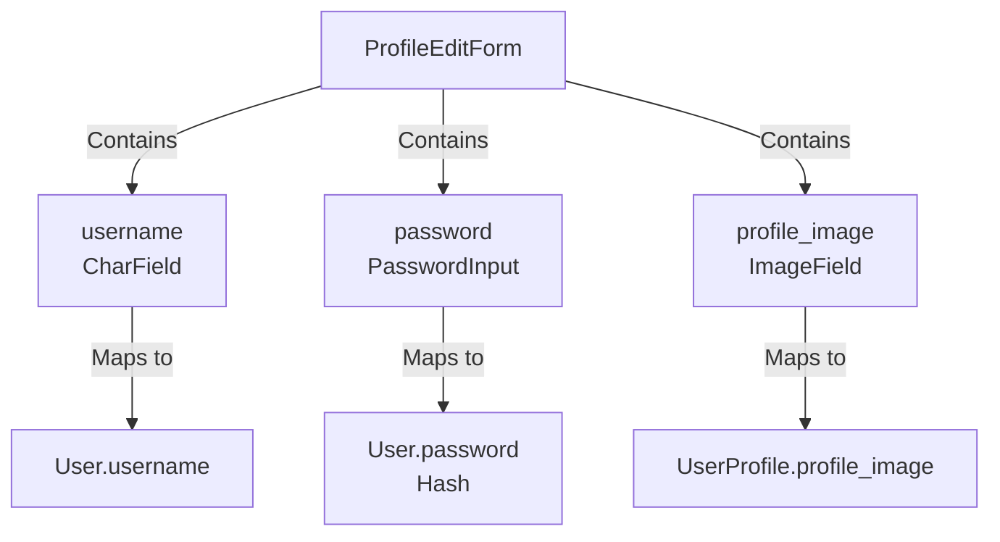
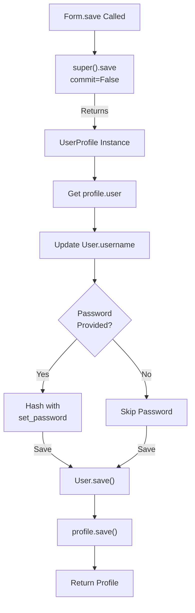

# Accounts Forms Documentation

## 1. Overview

The accounts forms module defines custom forms for user profile management. The `ProfileEditForm` extends Django's ModelForm to provide comprehensive profile editing functionality with username, password, and image upload support.

**Purpose:** Handle form validation and rendering for profile editing operations.

**Responsibility:** Validate profile data and coordinate updates to both User and UserProfile models.

## 2. File Location

- **Source path:** `accounts/forms.py`

## 3. Key Components

### Class: `ProfileEditForm` (extends ModelForm)

**Purpose:** Provide form for editing user profile information

**Model:** UserProfile

#### Fields

**`username`** (CharField)

- Max length: 150
- Purpose: Edit the associated User's username
- Not part of UserProfile but bound via custom save()

**`password`** (CharField)

- Widget: PasswordInput (masked input)
- Required: False (optional field)
- Purpose: Allow users to change password during profile edit
- Not part of UserProfile but bound via custom save()

**`profile_image`** (ImageField)

- Required: False
- Purpose: Allow image upload
- From UserProfile model

#### Meta Configuration

```python
model = UserProfile
fields = ['profile_image']  # Only UserProfile field included
```

#### Custom Methods

**`save(commit=True)`**

- **Purpose:** Handle saving both User and UserProfile models atomically
- **Parameters:**
  - `commit` (bool): Whether to commit changes to database
- **Process:**
  1. Save form without committing (commit=False)
  2. Get associated User object
  3. Update User.username from form data
  4. Update User password if provided
  5. Save User to database (if commit=True)
  6. Save UserProfile to database (if commit=True)
  7. Return profile instance
- **Returns:** Updated UserProfile instance

## 4. Execution Flow

**Form Submission & Save Flow:**

```
1. User submits profile edit form
2. Form.__init__() called with POST/FILES data
3. Form validation occurs (clean methods)
4. If valid, save() is called
5. Super().save(commit=False) saves form fields
6. User object retrieved via profile.user
7. Username updated on User model
8. Password updated (if provided and non-empty)
9. User saved to database
10. UserProfile saved to database
11. Return updated profile to view
```

**Password Handling:**

```
Form submission → Check if password provided → If truthy, hash via set_password() → Save User
```

## 5. Data Flow

### Inputs

- Form data from POST request:
  - `username`: String for User.username
  - `password`: String for User password (optional)
  - `profile_image`: Image file (optional)

### Processing

- **Validation:**

  - Username field validates character length
  - Password field is optional (required=False)
  - Image field validates image format

- **Form Operations:**

  - Bind form to UserProfile instance
  - Separate User fields (username, password)
  - Separate UserProfile fields (profile_image)

- **Save Operation:**
  - Create UserProfile object with profile_image
  - Update related User object separately
  - Hash password using Django's set_password()
  - Atomically save both objects

### Outputs

- Saved UserProfile with updated profile_image
- Updated User with new username and/or password
- Form returns UserProfile instance

### Dependencies

- Django forms module
- UserProfile model
- User model (accessed via profile.user)

## 6. Mermaid Diagrams

**Form Field Mapping:**



**Save Process Flow:**



## 7. Error Handling & Edge Cases

### Possible Failures

- **Invalid image format:** Django's ImageField validation rejects non-image files
- **Duplicate username:** Form doesn't validate uniqueness (validation in view)
- **Password mismatch:** No matching field (handled by view if needed)
- **File upload too large:** Handled by Django's file upload handler

### Edge Cases

- **Empty password field:** Skipped (required=False), no password change
- **Same username:** Allowed (form doesn't validate uniqueness)
- **Removing profile image:** Can set to None/clear
- **No image provided:** Field remains unchanged in database
- **Username length edge:** Max 150 characters enforced by User model

## 8. Example Usage

### Creating and Validating Form

```python
from accounts.forms import ProfileEditForm
from accounts.models import UserProfile

profile = request.user.userprofile

# Create form with initial values
form = ProfileEditForm(instance=profile)

# Alternative: Create form with POST data
form = ProfileEditForm(
    request.POST,
    request.FILES,
    instance=profile
)

# Validate
if form.is_valid():
    profile = form.save()  # Saves both User and UserProfile
```

### Form Rendering in Template

```django

<form method="POST" enctype="multipart/form-data">
    

    {{ form.username }}
    {{ form.password }}
    {{ form.profile_image }}

    <button type="submit">Save Profile</button>
</form>
```

### View Usage

```python
@login_required
def edit_profile(request):
    profile = request.user.userprofile

    if request.method == 'POST':
        form = ProfileEditForm(
            request.POST,
            request.FILES,
            instance=profile
        )
        if form.is_valid():
            form.save()  # Updates both User and UserProfile
            return redirect('dashboard')
    else:
        form = ProfileEditForm(
            initial={'username': request.user.username},
            instance=profile
        )

    return render(request, 'edit_profile.html', {'form': form})
```

### Password Change Example

```python
# User changes password while editing profile
form = ProfileEditForm(
    {
        'username': 'john_doe',
        'password': 'NewPassword123!',
        'profile_image': uploaded_file
    },
    instance=profile
)

if form.is_valid():
    profile = form.save()
    # User's password is now hashed and saved
    # User can login with new password immediately
```
