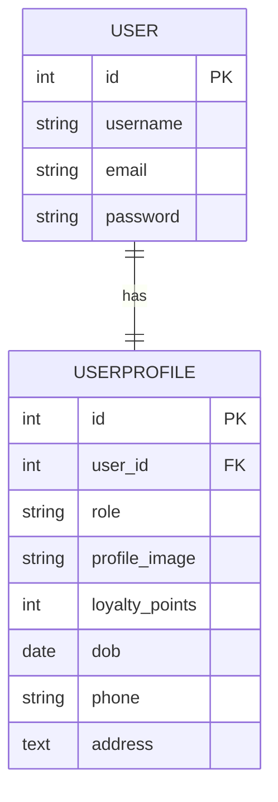
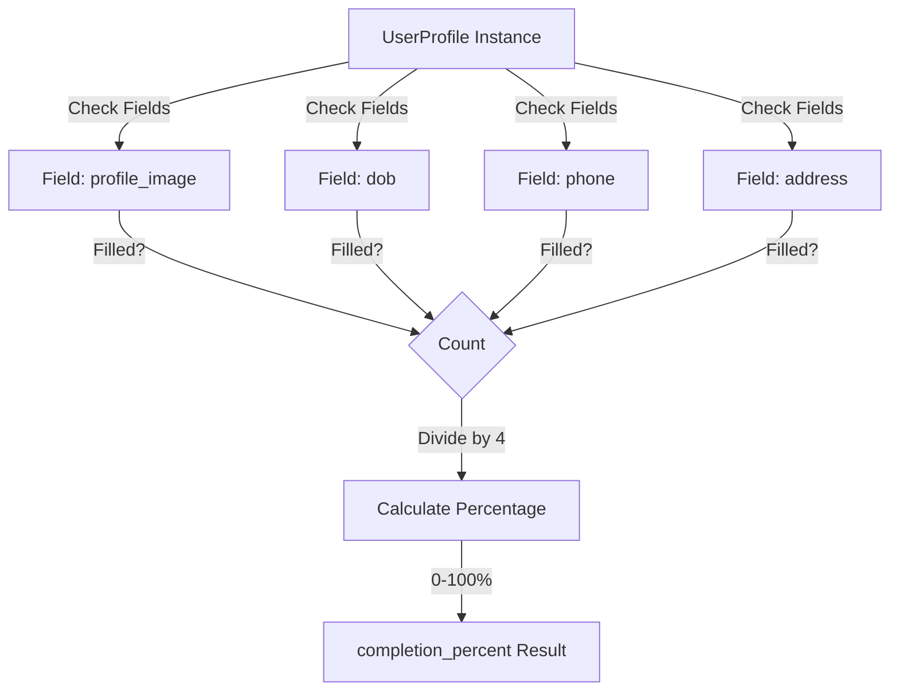

# Accounts Models Documentation

## 1. Overview

The accounts module contains the `UserProfile` model which extends Django's built-in `User` model with hotel-specific user attributes including role management, profile images, loyalty points, and personal information.

**Purpose:** Extend Django User model with profile-specific data for hotel guests and staff.

**Responsibility:** Store user profile information, manage user roles, track loyalty points, and provide calculated fields for user metrics.

## 2. File Location

- **Source path:** `accounts/models.py`

## 3. Key Components

### Class: `UserProfile`

#### Fields

- **`user`** (OneToOneField)

  - Links to Django's built-in User model
  - On delete: CASCADE (removes profile when user deleted)
  - Relationship: One user has exactly one profile

- **`role`** (CharField)

  - Choices: 'customer' or 'worker'
  - Default: 'customer'
  - Max length: 20
  - Purpose: Distinguish between guest and staff users

- **`profile_image`** (ImageField)

  - Upload path: `profile_images/`
  - Nullable and optional
  - Stores user profile picture

- **`loyalty_points`** (IntegerField)

  - Default: 0
  - Purpose: Track reward points for bookings and orders
  - Non-negative value

- **`dob`** (DateField)

  - Nullable and optional
  - Stores date of birth
  - Used to calculate user age

- **`phone`** (CharField)

  - Max length: 20
  - Optional field
  - Stores contact number

- **`address`** (TextField)
  - Optional field
  - Stores residential or billing address

#### Methods

**`__str__()`**

- **Purpose:** String representation of profile
- **Returns:** Format: `"{username} ({role})"`
- **Example:** `"john_doe (customer)"`

**`age` (property)**

- **Purpose:** Calculate user's current age from date of birth
- **Returns:** Integer age or None if DOB not set
- **Calculation:** Accounts for month and day to ensure accurate age
- **Edge case:** Returns None if dob is not provided

**`completion_percent()`**

- **Purpose:** Calculate profile completion percentage
- **Returns:** Integer 0-100 representing percent completion
- **Fields checked:**
  - profile_image
  - dob
  - phone
  - address
- **Formula:** `(filled_fields / total_fields) * 100`

## 4. Execution Flow

```
1. User registers via accounts.register view
2. User and UserProfile created together
3. User can edit profile via accounts.edit_profile
4. Profile fields updated and saved to database
5. Profile accessible via request.user.userprofile
```

**Profile Creation Flow:**

```
register view → User.objects.create_user() → UserProfile.objects.create() → Store in DB
```

**Age Calculation Flow:**

```
Profile has dob → Get current date → Calculate difference in years → Account for month/day → Return age
```

## 5. Data Flow

### Inputs

- **From registration:**

  - username, email, password from User model
  - role (default: 'customer')

- **From profile edit:**
  - profile_image (file)
  - dob (date)
  - phone (string)
  - address (text)
  - loyalty_points (integer)

### Processing

- Store user identity via OneToOneField relationship
- Validate role choices
- Process and store image files
- Calculate computed properties (age, completion_percent)
- Maintain referential integrity with User model

### Outputs

- Profile instance with all fields populated
- Computed properties: age, completion_percent
- String representation via **str**

### Dependencies

- Django User model (`django.contrib.auth.models.User`)
- Django ORM models base class
- Python datetime for age calculation

## 6. Mermaid Diagrams



**Profile Completion Workflow:**



## 7. Error Handling & Edge Cases

### Possible Failures

- **Duplicate user:** Foreign key would prevent invalid references
- **Missing DOB:** `age` property gracefully returns None
- **Invalid image file:** Django's FileField validation handles rejection
- **Orphaned profile:** Cascade delete prevents inconsistent state

### Edge Cases

- **New user (no dob):** Age property returns None instead of error
- **Leap year births:** Python's date arithmetic handles correctly
- **Empty optional fields:** Completion percent still calculates (0% if all empty, 25% per field)
- **Profile without image:** Image field allows null/blank
- **Role change:** Can be updated via admin or application logic

## 8. Example Usage

### Creating a User Profile

```python
from django.contrib.auth.models import User
from accounts.models import UserProfile

# User created via registration
user = User.objects.create_user(
    username='john_doe',
    email='john@example.com',
    password='secure_pass'
)

# Profile automatically created or manually:
profile = UserProfile.objects.create(
    user=user,
    role='customer',
    dob='1990-05-15',
    phone='+1-555-0123',
    address='123 Main St'
)

# Accessing profile
user.userprofile  # Returns UserProfile instance
profile.age  # Returns: 34 (as of 2024)
profile.completion_percent()  # Returns: 75 (4/5 fields filled if no image)
str(profile)  # Returns: "john_doe (customer)"
```

### Updating Profile

```python
profile = request.user.userprofile
profile.loyalty_points += 50
profile.phone = '+1-555-9999'
profile.save()
```

### Role-Based Access

```python
profile = request.user.userprofile
if profile.role == 'worker':
    # Show worker dashboard
elif profile.role == 'customer':
    # Show customer dashboard
```
