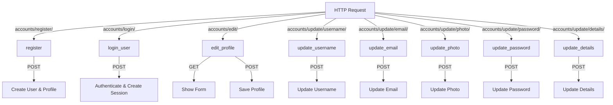
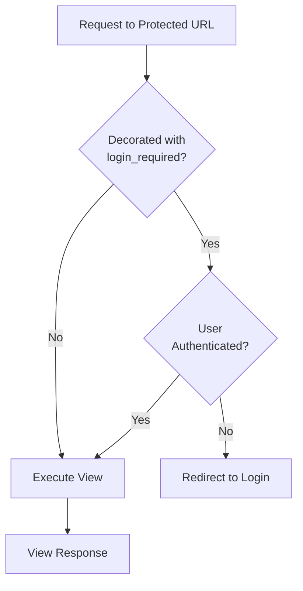

# Accounts URLs Configuration Documentation

## 1. Overview

The accounts URL configuration defines all routing endpoints for user account management functionality. This includes registration, login, profile editing, and various profile update operations.

**Purpose:** Map URL patterns to account-related views for user authentication and profile management.

**Responsibility:** Route user requests to appropriate account management view functions.

## 2. File Location

- **Source path:** `accounts/urls.py`

## 3. Key Components

### URL Patterns

All patterns use the form `path('route/', views.view_function, name='url_name')`

#### Registration

```
Path: accounts/register/
View: register
Name: 'register'
Method: POST (form submission)
Purpose: Handle new user registration
```

#### Login

```
Path: accounts/login/
View: login_user
Name: 'login'
Method: POST (form submission)
Purpose: Authenticate existing users
```

#### Profile Editing

```
Path: accounts/edit/
View: edit_profile
Name: 'edit_profile'
Method: GET (form display), POST (form submission)
Purpose: Edit profile information
Required Auth: Yes (login_required)
Template: accounts/edit_profile.html
```

#### Username Update

```
Path: accounts/update/username/
View: update_username
Name: 'update_username'
Method: POST (AJAX)
Purpose: Update user's username via API
Required Auth: Yes
Response: JSON
```

#### Email Update

```
Path: accounts/update/email/
View: update_email
Name: 'update_email'
Method: POST (AJAX)
Purpose: Update user's email address via API
Required Auth: Yes
Response: JSON
```

#### Profile Photo Update

```
Path: accounts/update/photo/
View: update_photo
Name: 'update_photo'
Method: POST (AJAX, multipart form-data)
Purpose: Upload and update profile picture
Required Auth: Yes
Response: JSON
```

#### Password Update

```
Path: accounts/update/password/
View: update_password
Name: 'update_password'
Method: POST (AJAX)
Purpose: Change user's password
Required Auth: Yes
Response: JSON
```

#### Details Update

```
Path: accounts/update/details/
View: update_details
Name: 'update_details'
Method: POST (AJAX)
Purpose: Update personal details (DOB, phone, address)
Required Auth: Yes
Response: JSON
```

## 4. Execution Flow

**URL Resolution Flow:**

```
1. User navigates to /accounts/route/
2. Django URL router matches pattern
3. Named URL identified
4. Associated view function called
5. View processes request
6. Response returned to user
```

**Typical Request Flow:**

```
Browser Request → URL Router → accounts.urls → View Function → Processing → Response
```

**Authentication Flow for Protected Routes:**

```
Request to /accounts/edit/ → login_required decorator → Check if authenticated
├─ If not: Redirect to login
└─ If yes: Execute view function
```

## 5. Data Flow

### Inputs

- URL patterns define routing structure
- URL names enable reverse URL lookup in templates/code
- View functions defined in accounts.views module

### Processing

- Django URLconf pattern matching
- View function selection based on path
- Decorator application (login_required, csrf_exempt)
- Request/response handling

### Outputs

- HTTP response from matched view function
- Redirects to other URLs as needed
- JSON responses for AJAX endpoints
- Template rendering for form views

### Dependencies

- Django URL routing system (`django.urls.path`, `include`)
- accounts.views module (all view functions)
- login_required decorator (Django auth)

## 6. Mermaid Diagrams

**URL Routing Map:**



**Authentication Guard:**



## 7. Error Handling & Edge Cases

### Possible Failures

- **Invalid URL:** Django returns 404 Not Found
- **Missing view function:** ImportError during Django startup
- **Authentication required but user not logged in:** Redirect to login view

### Edge Cases

- **URL name conflicts:** Last defined pattern wins (should avoid)
- **Case sensitivity:** URL paths are case-sensitive
- **Trailing slash:** Django can normalize based on APPEND_SLASH setting
- **Special characters in URL:** Must be properly encoded/escaped
- **Reverse lookup before URL loaded:** Returns error if urlpatterns not loaded

## 8. Example Usage

### Reverse URL Lookup

```python
from django.urls import reverse

# In view
url = reverse('register')  # Returns: /accounts/register/
url = reverse('edit_profile')  # Returns: /accounts/edit/
url = reverse('update_photo')  # Returns: /accounts/update/photo/
```

### URL Reference in Template

```django
<!-- Registration link -->
<a href="">Create Account</a>

<!-- Edit profile form -->
<form method="POST" action="">
    
    {{ form }}
    <button type="submit">Save</button>
</form>

<!-- AJAX endpoints -->
<script>
    fetch("", { method: 'POST', ... })
</script>
```

### Project-level URL Inclusion

In main `hotelgrand/urls.py`:

```python
from django.urls import path, include

urlpatterns = [
    path('accounts/', include('accounts.urls')),  # Mounts all accounts URLs
]
```

### URL Name Usage in Redirect

```python
from django.shortcuts import redirect

def register(request):
    if form.is_valid():
        # Create user...
        return redirect('login')  # Redirects to /accounts/login/
```

### AJAX Request to Update Endpoint

```javascript
// JavaScript
const formData = new FormData();
formData.append("username", "new_username");

fetch("/accounts/update/username/", {
  method: "POST",
  body: formData,
})
  .then((response) => response.json())
  .then((data) => {
    if (data.success) {
      console.log("Username updated");
    } else {
      console.log("Error:", data.error);
    }
  });
```
