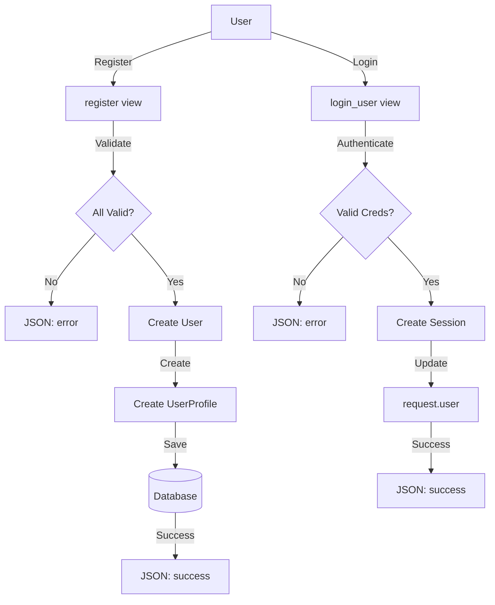
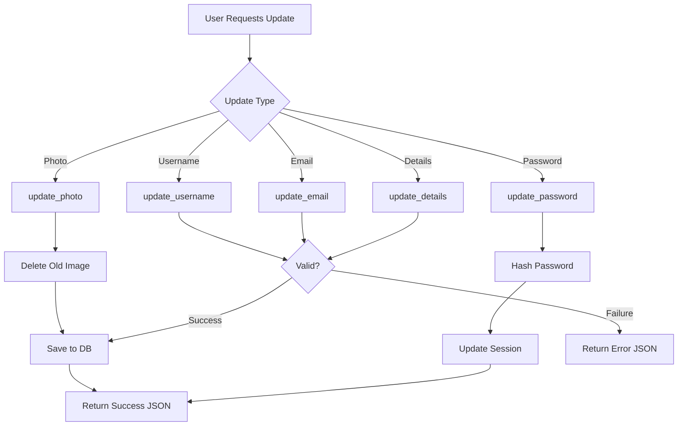

# Accounts Views Documentation

## 1. Overview
The accounts views module handles user authentication, registration, and profile management. It provides endpoints for user registration, login, profile editing, and updating user information including username, email, password, profile pictures, and personal details.

**Purpose:** Manage user account lifecycle and profile administration.

**Responsibility:** Handle authentication, registration, profile CRUD operations, and user data updates.

## 2. File Location
- **Source path:** `accounts/views.py`

## 3. Key Components

### Function: `register(request)` - [CSRF Exempt]

**Purpose:** Register new users in the system

**HTTP Methods:** POST

**Parameters:** 
- `username`: Desired username (string)
- `email`: Email address (string)
- `password1`: Password (string)
- `password2`: Password confirmation (string)

**Returns:** JSON response
- Success: `{'success': True}`
- Failure: `{'success': False, 'error': '<message>'}`

**Validations:**
1. Passwords must match
2. Username must be unique
3. Email must be unique

**Side Effects:**
- Creates new User object
- Creates associated UserProfile with role='customer'

---

### Function: `login_user(request)` - [CSRF Exempt]

**Purpose:** Authenticate existing users

**HTTP Methods:** POST

**Parameters:**
- `username`: User's username (string)
- `password`: User's password (string)

**Returns:** JSON response
- Success: `{'success': True}`
- Failure: `{'success': False, 'error': 'Invalid username or password'}`

**Side Effects:**
- Creates session for authenticated user
- Updates request.user object

---

### Function: `edit_profile(request)` - [Login Required]

**Purpose:** Allow users to edit their profile information

**HTTP Methods:** GET, POST

**Parameters (POST):**
- Form data from ProfileEditForm (username, password, profile_image)

**Returns:**
- GET: Rendered template with form
- POST: Redirect to customer_dashboard on success

**Template:** `accounts/edit_profile.html`

**Initial Form Values:**
- username from request.user.username
- profile_image from current profile

---

### Function: `update_username(request)` - [CSRF Exempt, Login Required]

**Purpose:** Update user's username

**HTTP Methods:** POST

**Parameters:**
- `username`: New desired username (string)

**Returns:** JSON response
- Success: `{'success': True}`
- Failure: `{'success': False, 'error': '<message>'}`

**Validations:**
- New username must be unique (excluding current user)

**Side Effects:**
- Updates User.username
- Saves to database

---

### Function: `update_email(request)` - [CSRF Exempt, Login Required]

**Purpose:** Update user's email address

**HTTP Methods:** POST

**Parameters:**
- `email`: New email address (string)

**Returns:** JSON response
- Success: `{'success': True}`
- Failure: `{'success': False, 'error': '<message>'}`

**Validations:**
- New email must be unique (excluding current user)

**Side Effects:**
- Updates User.email
- Saves to database

---

### Function: `update_photo(request)` - [CSRF Exempt, Login Required]

**Purpose:** Upload and update profile picture

**HTTP Methods:** POST

**Parameters:**
- `profile_image`: Image file from request.FILES

**Returns:** JSON response
- Success: `{'success': True}`
- Failure: `{'success': False, 'error': '<message>'}`

**Side Effects:**
- Deletes old profile image if exists (and not default)
- Saves new profile image to UserProfile
- Updates database

**File Handling:**
- Checks if old image exists and is not default
- Removes old file from file system
- Saves new file to media directory

---

### Function: `update_password(request)` - [CSRF Exempt, Login Required]

**Purpose:** Change user's password

**HTTP Methods:** POST

**Parameters:**
- `old_password`: Current password (string)
- `new_password1`: New password (string)
- `new_password2`: New password confirmation (string)

**Returns:** JSON response
- Success: `{'success': True}`
- Failure: `{'success': False, 'error': '<message>'}`

**Validations:**
- Old password must be correct
- New passwords must match

**Side Effects:**
- Sets new password
- Updates session authentication (prevents logout)
- Saves to database

---

### Function: `update_details(request)` - [CSRF Exempt, Login Required]

**Purpose:** Update user's personal details

**HTTP Methods:** POST

**Parameters:**
- `dob`: Date of birth (string, optional)
- `phone`: Phone number (string)
- `address`: Address (string)

**Returns:** JSON response
- Success: `{'success': True}`
- Failure: `{'success': False, 'error': '<message>'}`

**Side Effects:**
- Updates UserProfile fields
- Saves to database

---

## 4. Execution Flow

**Registration Flow:**
```
1. User submits registration form (POST)
2. Validate password match
3. Check username uniqueness
4. Check email uniqueness
5. Create User object
6. Create UserProfile with role='customer'
7. Return success JSON
8. Client redirects to login
```

**Login Flow:**
```
1. User submits credentials (POST)
2. Django authenticate() validates user
3. If valid, login() creates session
4. Return success JSON
5. Client redirects to dashboard
```

**Password Update Flow:**
```
1. User submits old + new passwords (POST)
2. Verify old password is correct
3. Validate new passwords match
4. Hash new password with set_password()
5. Save to database
6. Update session with update_session_auth_hash()
7. Return success JSON
```

**Profile Photo Update Flow:**
```
1. User uploads image file (POST)
2. Get user's current profile
3. If old image exists:
   - Check if it's not default
   - Construct file path
   - Delete old file from filesystem
4. Save new image to profile
5. Commit to database
6. Return success JSON
```

## 5. Data Flow

### Inputs
- HTTP POST form data:
  - Registration: username, email, password1, password2
  - Login: username, password
  - Profile edit: username, password (optional), profile_image
  - Updates: Specific field values

### Processing
- **Authentication:** Django's authenticate() & login() functions
- **Validation:** Uniqueness checks, password comparison
- **File handling:** Image upload, old file deletion
- **Password security:** Hashing via set_password()
- **Session management:** Create session, maintain auth hash

### Outputs
- JSON responses for AJAX requests
- Redirects to templates/dashboards
- Updated User/UserProfile in database
- Modified session state

### Dependencies
- Django User model
- UserProfile model
- ProfileEditForm
- Django authentication system
- File system operations (os module)

## 6. Mermaid Diagrams

**Registration & Login Flow:**


**Profile Update Operations:**


## 7. Error Handling & Edge Cases

### Possible Failures
- **Password mismatch:** Returns validation error
- **Duplicate username/email:** Returns already taken error
- **Incorrect old password:** Password update fails
- **Missing required fields:** Returns error
- **Invalid file upload:** Image upload fails gracefully
- **File system error:** Old image deletion may fail (caught but not reported)
- **Session error:** update_session_auth_hash prevents logout

### Edge Cases
- **User changes to same username:** Allowed (validation excludes self)
- **Non-existent old image:** update_photo handles gracefully
- **Default avatar:** Old file deletion skips default image
- **Concurrent updates:** Last write wins (no locking)
- **Empty password field in profile edit:** Optional, skips password change
- **Optional fields (DOB, phone, address):** Can be null/empty

## 8. Example Usage

### Registration
**Endpoint:** `POST /accounts/register/`

**Request:**
```json
{
    "username": "alice_wonder",
    "email": "alice@example.com",
    "password1": "SecurePass123!",
    "password2": "SecurePass123!"
}
```

**Success Response:**
```json
{"success": true}
```

**Error Response:**
```json
{"success": false, "error": "Passwords do not match"}
```

### Login
**Endpoint:** `POST /accounts/login/`

**Request:**
```json
{
    "username": "alice_wonder",
    "password": "SecurePass123!"
}
```

**Response:**
```json
{"success": true}
```

### Update Password
**Endpoint:** `POST /accounts/update/password/` [Login Required]

**Request:**
```json
{
    "old_password": "SecurePass123!",
    "new_password1": "NewPass456!",
    "new_password2": "NewPass456!"
}
```

**Response:**
```json
{"success": true}
```

### Update Profile Photo
**Endpoint:** `POST /accounts/update/photo/` [Login Required, Multipart]

**Request:** Multipart form with `profile_image` file

**Response:**
```json
{"success": true}
```

### Update Personal Details
**Endpoint:** `POST /accounts/update/details/` [Login Required]

**Request:**
```json
{
    "dob": "1995-03-20",
    "phone": "+1-555-0123",
    "address": "456 Oak Avenue, City, State"
}
```

**Response:**
```json
{"success": true}
```
