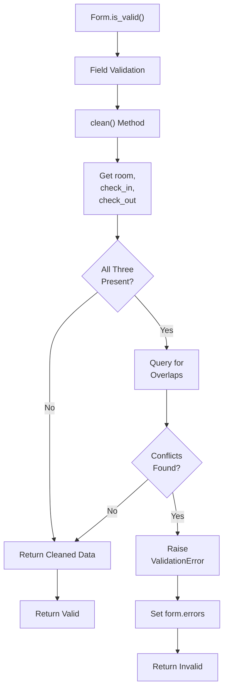
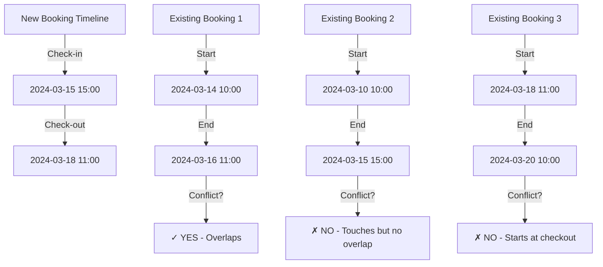

# Booking Forms Documentation

## 1. Overview

The booking forms module provides form classes for room availability filtering and booking operations. These forms handle date-based room searching and booking submission with conflict validation.

**Purpose:** Validate and process user input for booking-related operations.

**Responsibility:** Handle form validation, availability checking, and booking conflict detection at the form level.

## 2. File Location

- **Source path:** `booking/forms.py`

## 3. Key Components

### Class: `PrivateBookingForm` (extends ModelForm)

**Purpose:** Validate booking data and detect room conflicts before creation

**Model:** Booking

**Meta Configuration:**

```python
model = Booking
fields = ['room', 'check_in', 'check_out', 'special_requests', 'rating', 'review']
```

#### Fields

**`room`** (ModelChoiceField)

- **Source:** Booking.room ForeignKey
- **Queryset:** All Room objects
- **Required:** True

**`check_in`** (DateTimeField)

- **Source:** Booking.check_in field
- **Widget:** HTML5 date input
- **Attribute:** `type="date"`
- **Required:** True

**`check_out`** (DateTimeField)

- **Source:** Booking.check_out field
- **Widget:** HTML5 date input
- **Attribute:** `type="date"`
- **Required:** True

**`special_requests`** (CharField)

- **Source:** Booking.special_requests field
- **Widget:** Textarea (3 rows)
- **Required:** False

**`rating`** (IntegerField)

- **Source:** Booking.rating field
- **Required:** False
- **Range:** Typically 1-5

**`review`** (CharField)

- **Source:** Booking.review field
- **Widget:** Textarea (3 rows)
- **Required:** False

#### Custom Methods

**`clean()`**

- **Purpose:** Validate booking dates and check for room conflicts
- **Validation Steps:**
  1. Call parent clean() to validate individual fields
  2. Get room, check_in, check_out from cleaned_data
  3. If all three are present:
     - Query Booking model for overlapping bookings
     - Check for bookings with:
       - Same room
       - check_in < form's check_out
       - check_out > form's check_in
  4. If conflicts exist: Raise ValidationError
     - Message: "This room is already booked for the selected dates."

**Logic:**

```python
def clean(self):
    cleaned_data = super().clean()
    room = cleaned_data.get("room")
    check_in = cleaned_data.get("check_in")
    check_out = cleaned_data.get("check_out")

    if room and check_in and check_out:
        # Find overlapping bookings
        conflicts = Booking.objects.filter(
            room=room,
            check_in__lt=check_out,      # Existing booking starts before new check_out
            check_out__gt=check_in       # Existing booking ends after new check_in
        )
        if conflicts.exists():
            raise forms.ValidationError("❌ This room is already booked...")
    return cleaned_data
```

---

### Class: `AvailabilityForm`

**Purpose:** Filter rooms by availability based on check-in/check-out dates

**Form Type:** Regular Form (not ModelForm)

#### Fields

**`check_in`** (DateTimeField)

- **Widget:** DateInput(type="date")
- **Required:** True
- **Label:** "Check-in Date"

**`check_out`** (DateTimeField)

- **Widget:** DateInput(type="date")
- **Required:** True
- **Label:** "Check-out Date"

#### Methods

No custom validation in clean() method. Validation delegated to views.

---

## 4. Execution Flow

**PrivateBookingForm Submission Flow:**

```
1. Form initialized with POST data
2. Form.is_valid() called
3. Field-level validation occurs
4. clean() method called:
   a. Validate individual fields
   b. Query for room conflicts
   c. Raise error if conflicts found
5. If valid: Form ready to save()
6. If invalid: Error dict populated
```

**Conflict Detection Logic:**

```
User selects room with:
  check_in = 2024-03-15 15:00
  check_out = 2024-03-18 11:00

Query for conflicts:
  - room = selected_room
  - existing.check_in < 2024-03-18 11:00 (starts before new checkout)
  - existing.check_out > 2024-03-15 15:00 (ends after new check-in)

Example overlaps caught:
  ✓ 2024-03-14 to 2024-03-16 (extends into new dates)
  ✓ 2024-03-15 to 2024-03-20 (completely overlaps)
  ✓ 2024-03-16 to 2024-03-17 (contained within)
  ✗ 2024-03-10 to 2024-03-15 (ends at check-in, no overlap)
  ✗ 2024-03-18 to 2024-03-25 (starts at checkout, no overlap)
```

## 5. Data Flow

### Inputs

**PrivateBookingForm:**

- room (integer ID)
- check_in (date string)
- check_out (date string)
- special_requests (text, optional)
- rating (integer 1-5, optional)
- review (text, optional)

**AvailabilityForm:**

- check_in (date string)
- check_out (date string)

### Processing

- **Field Validation:** Django's default field validators
- **Type Conversion:** String dates converted to datetime objects
- **Conflict Detection:** Database query for overlapping bookings
- **Error Collection:** Validation errors accumulated in form.errors dict

### Outputs

- Validated form data in cleaned_data dict
- Error messages for invalid fields
- ValidationError preventing save if conflicts detected

### Dependencies

- Booking model
- Room model
- Django forms module
- Database query system

## 6. Mermaid Diagrams

**Form Validation Flow:**



**Booking Overlap Detection Visualization:**



## 7. Error Handling & Edge Cases

### Possible Failures

- **Invalid date format:** Django DateInput handles parsing, shows validation error
- **check_out before check_in:** Not validated by form (handled in views)
- **Room not found:** ModelChoiceField shows "Select a valid choice" error
- **Non-existent booking conflict:** Query returns empty, no error
- **Database error on conflict query:** Exception propagates, unhandled

### Edge Cases

- **Same-day booking:** Valid (date-based, not time-based)
- **Null date fields:** Required=True prevents, shows validation error
- **Identical to existing booking:** clean() catches as conflict
- **Booking starts/ends at boundaries:** Not considered conflict (no overlap)
- **Empty special_requests/review:** Allowed (optional fields)
- **Rating without review:** Allowed (independent fields)
- **Rating out of range:** No validation (1-5 enforcement missing)

## 8. Example Usage

### Using PrivateBookingForm

```python
from booking.forms import PrivateBookingForm

# GET request - show empty form
form = PrivateBookingForm()

# POST request - validate booking
form = PrivateBookingForm(request.POST)

if form.is_valid():
    # No conflicts, safe to save
    booking = form.save(commit=False)
    booking.guest_name = request.user.username
    booking.status = "confirmed"
    booking.save()  # Auto-calculates total_price
else:
    # Show errors
    errors = form.errors
    # {'__all__': ['This room is already booked...']}
```

### Template Rendering

```django


<form method="POST">
    

    {{ form.room }}
    {{ form.check_in }}
    {{ form.check_out }}
    {{ form.special_requests }}
    {{ form.rating }}
    {{ form.review }}

    
        <div class="error">
            {{ form.non_field_errors }}
        </div>
    

    <button type="submit">Book Room</button>
</form>
```

### Using AvailabilityForm

```python
from booking.forms import AvailabilityForm

form = AvailabilityForm(request.POST or None)

if form.is_valid():
    check_in = form.cleaned_data['check_in']
    check_out = form.cleaned_data['check_out']

    # View handles filtering rooms
    available_rooms = filter_available_rooms(
        check_in,
        check_out
    )
```

### Error Handling Example

```python
form = PrivateBookingForm(request.POST)

if form.is_valid():
    booking = form.save()
else:
    # Access specific errors
    if 'room' in form.errors:
        print(form.errors['room'])  # ['This field is required.']

    if '__all__' in form.errors:
        print(form.errors['__all__'])  # Conflict error
```
