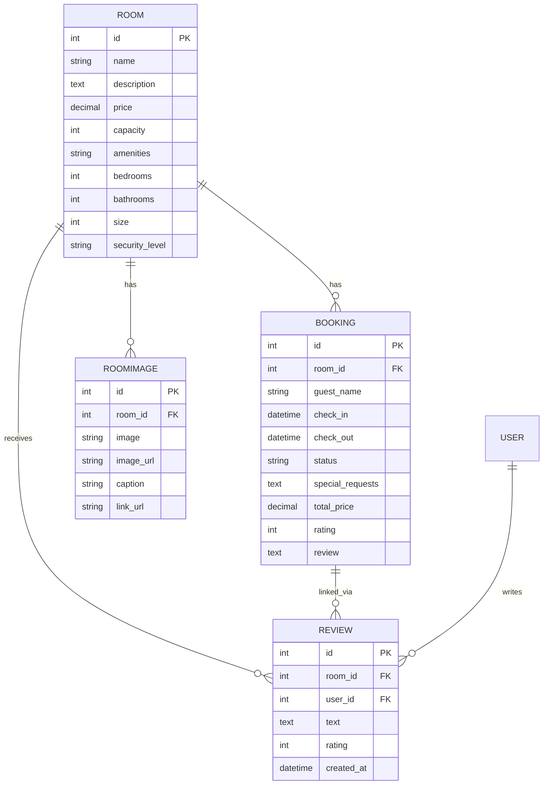
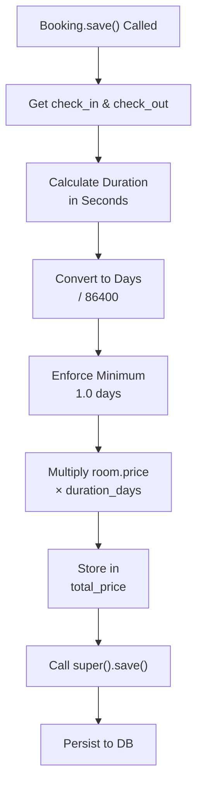

# Booking Models Documentation

## 1. Overview

The booking module contains models for managing hotel room reservations, room details, room images, and guest reviews. It handles room inventory, availability tracking, booking lifecycle, and customer feedback.

**Purpose:** Define the data structure for room management, booking operations, and review systems.

**Responsibility:** Store room information, manage booking records, track room images, and maintain guest reviews.

## 2. File Location

- **Source path:** `booking/models.py`

## 3. Key Components

### Class: `Room`

**Purpose:** Represent a hotel room with its properties and pricing

#### Fields

- **`name`** (CharField) - Max length: 100, room identifier
- **`image`** (ImageField) - Upload path: room_images/, primary room image
- **`image_url`** (URLField) - Optional external image URL
- **`description`** (TextField) - Detailed room description
- **`price`** (DecimalField) - Max 8 digits, 2 decimal places (e.g., 999999.99)
- **`capacity`** (IntegerField) - Number of guests the room accommodates
- **`amenities`** (CharField) - Comma-separated amenities list
- **`bedrooms`** (IntegerField) - Default: 1
- **`bathrooms`** (IntegerField) - Default: 1
- **`size`** (IntegerField) - Square footage, default: 500
- **`security_level`** (CharField) - Default: "Standard" (e.g., Standard, VIP, Luxury)

#### Methods

**`__str__()`** - Returns room name for admin display

---

### Class: `RoomImage`

**Purpose:** Store multiple images for each room with captions and external links

#### Fields

- **`room`** (ForeignKey) - Links to Room model, cascade delete, related_name: "images"
- **`image`** (ImageField) - Upload path: room_images/, optional
- **`image_url`** (URLField) - External image URL, optional
- **`caption`** (CharField) - Max 100, image description
- **`link_url`** (URLField) - Optional link associated with image

#### Methods

**`get_image_source()`**

- **Purpose:** Return active image source (URL-based or file-based)
- **Returns:** image_url if set, otherwise image.url if image exists, else None
- **Logic:** Prioritizes external URLs over uploaded files

**`clean()`** (Validation)

- **Purpose:** Validate that exactly one image source is provided
- **Rules:**
  - At least one of image or image_url must be provided
  - Cannot provide both image and image_url
- **Raises:** ValidationError if validation fails

---

### Class: `Booking`

**Purpose:** Represent a room reservation with dates, pricing, and guest information

#### Fields

- **`room`** (ForeignKey) - Links to Room, cascade delete
- **`guest_name`** (CharField) - Max 100, name of guest
- **`check_in`** (DateTimeField) - Check-in date and time
- **`check_out`** (DateTimeField) - Check-out date and time
- **`status`** (CharField) - Default: 'pending' (pending, confirmed, checked_in, completed)
- **`special_requests`** (TextField) - Optional guest notes/preferences
- **`total_price`** (DecimalField) - Auto-calculated, nullable
- **`rating`** (IntegerField) - 1-5 stars, optional
- **`review`** (TextField) - Guest feedback, optional

#### Methods

**`save(override_for_save, \*args, **kwargs)`\*\*

- **Purpose:** Auto-calculate total_price before saving
- **Logic:**
  1. Calculate duration in days: (check_out - check_in).total_seconds() / 86400
  2. If duration < 1 day, use minimum of 1 day
  3. total_price = room.price × max(duration_days, 1.0)
  4. Call parent save()
- **Note:** Handles decimal precision for fractional days

---

### Class: `Review`

**Purpose:** Store guest reviews for rooms with ratings

#### Fields

- **`room`** (ForeignKey) - Links to Room, cascade delete, related_name: "reviews"
- **`user`** (ForeignKey) - Links to User, cascade delete
- **`text`** (TextField) - Review content
- **`rating`** (IntegerField) - Default: 5 (typically 1-5 stars)
- **`created_at`** (DateTimeField) - Auto-set on creation

#### Methods

**`__str__()`** - Returns format: "Review by {username} for {room_name}"

---

### Form: `PrivateBookingForm` (ModelForm)

**Purpose:** Validate booking data for private/authenticated bookings

**Model:** Booking

**Fields Included:** room, check_in, check_out, special_requests, rating, review

**Widgets:**

- check_in, check_out: HTML5 date inputs
- special_requests, review: Textareas with 3 rows

**Custom Validation `clean()`:**

- Checks for booking conflicts
- Validates that check_out is after check_in
- Raises ValidationError if room already booked

---

## 4. Execution Flow

**Room Creation Flow:**

```
1. Administrator creates room via admin panel
2. Room fields validated and saved
3. Room becomes available for booking
4. Room can have multiple RoomImage objects
```

**Booking Creation Flow:**

```
1. Guest selects room and dates
2. PrivateBookingForm validates availability
3. Booking object created with status='pending'
4. save() method auto-calculates total_price
5. Booking saved to database
```

**Price Calculation:**

```
1. Booking.save() called
2. Calculate duration: (check_out_time - check_in_time) in seconds
3. Convert to days: total_seconds / 86400
4. Enforce minimum 1 day
5. Multiply room.price × duration_days
6. Store in total_price field
```

**Review Submission:**

```
1. Guest writes review text and rating
2. Review object created with room and user ForeignKeys
3. created_at auto-populated
4. Review saved to database
```

## 5. Data Flow

### Inputs

**Room Creation:**

- name, description, price, capacity, amenities, bedrooms, bathrooms, size, security_level
- image file (optional) or image_url

**Booking Creation:**

- room_id, check_in, check_out, guest_name, special_requests
- rating, review (optional)

**Review Submission:**

- room_id, user, text, rating

### Processing

- **Validation:** Form validation for bookings, model validation for images
- **Calculation:** Auto-calculation of total_price based on duration
- **Relationships:** Foreign key constraints maintain referential integrity
- **Timestamps:** Auto-population of created_at field

### Outputs

- Room records with pricing and amenities
- Booking records with calculated prices and status tracking
- Review records linked to specific rooms and users
- Image records associated with rooms

### Dependencies

- Django ORM models
- Decimal for price calculations
- datetime for duration calculations

## 6. Mermaid Diagrams

**Entity Relationship Diagram:**



**Booking Price Calculation Flow:**



## 7. Error Handling & Edge Cases

### Possible Failures

- **Invalid date range:** Check_in >= check_out not caught in model (caught in form)
- **Overlapping bookings:** Form validation prevents conflicts
- **Image validation:** Both image and image_url provided triggers ValidationError
- **Missing price:** Booking.save() handles null checks before calculation
- **Decimal precision:** DecimalField maintains precision, no rounding errors

### Edge Cases

- **Same-day booking:** Duration < 1 day, minimum enforced to 1 day
- **Fractional days:** Supports decimal pricing for hourly rates
- **No images:** Room can exist without RoomImage objects
- **Multiple images:** Room can have many RoomImage objects
- **Rating without review:** Rating can be set without text
- **Review without rating:** Default rating of 5 applied
- **Null total_price:** Booking created with null price (calculated on save)

## 8. Example Usage

### Creating a Room

```python
from booking.models import Room

room = Room.objects.create(
    name="Deluxe Suite",
    description="Spacious room with ocean view",
    price=150.00,
    capacity=2,
    amenities="WiFi, AC, Mini Bar, TV",
    bedrooms=1,
    bathrooms=1,
    size=400,
    security_level="Standard"
)
```

### Creating a Booking

```python
from booking.models import Booking, Room
from datetime import datetime, timedelta

room = Room.objects.get(id=1)
check_in = datetime(2024, 3, 15, 15, 0)
check_out = datetime(2024, 3, 18, 11, 0)

booking = Booking.objects.create(
    room=room,
    guest_name="John Doe",
    check_in=check_in,
    check_out=check_out,
    special_requests="Late checkout if possible",
    status="confirmed"
)
# booking.total_price auto-calculated to 150 × 3 = 450.00
```

### Adding Room Images

```python
from booking.models import RoomImage

# Using file upload
image = RoomImage.objects.create(
    room=room,
    image=uploaded_file,
    caption="Main bedroom"
)

# Using external URL
image = RoomImage.objects.create(
    room=room,
    image_url="https://example.com/image.jpg",
    caption="Bathroom"
)
```

### Submitting a Review

```python
from booking.models import Review
from django.contrib.auth.models import User

user = User.objects.get(username='john_doe')
review = Review.objects.create(
    room=room,
    user=user,
    text="Amazing room with great service!",
    rating=5
)
```

### Checking Availability

```python
from booking.models import Booking
from datetime import datetime

check_in = datetime(2024, 3, 15, 15, 0)
check_out = datetime(2024, 3, 18, 11, 0)

# Find overlapping bookings
conflicts = Booking.objects.filter(
    room=room,
    check_in__lt=check_out,
    check_out__gt=check_in,
    status="confirmed"
)

if not conflicts.exists():
    print("Room is available for selected dates")
```
