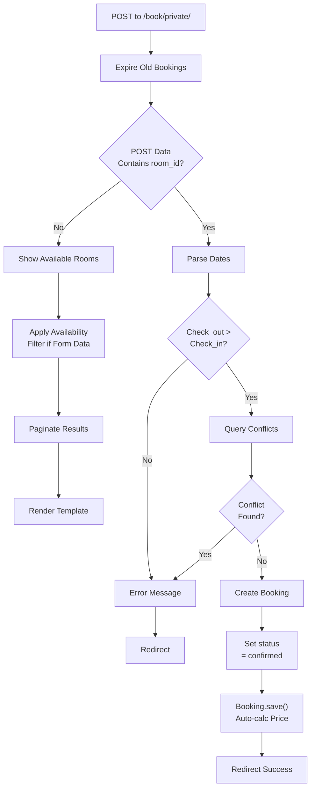
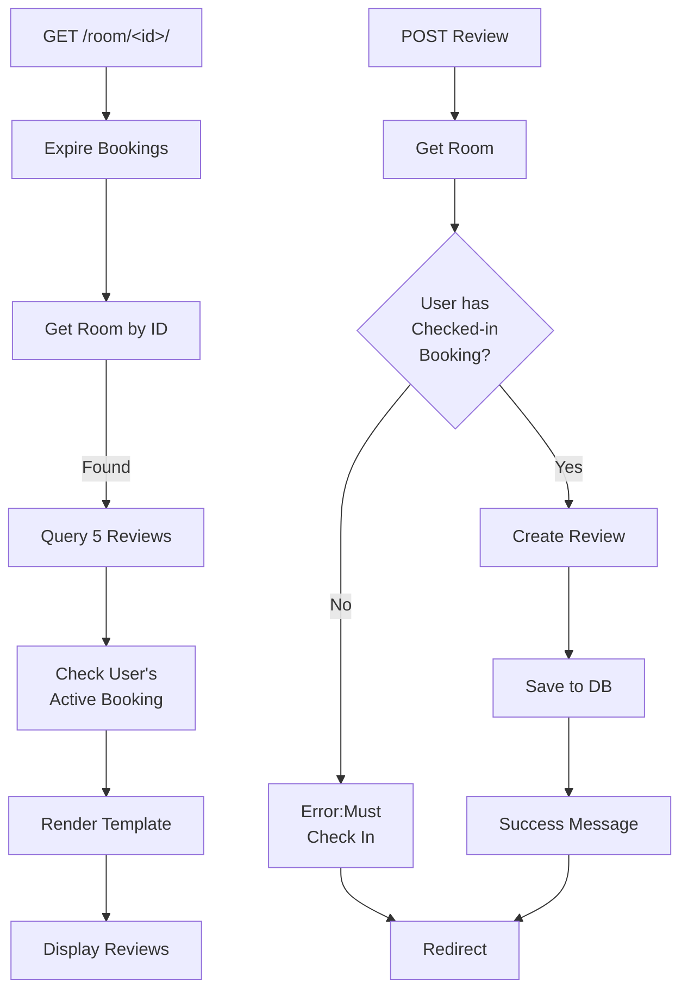

# Booking Views Documentation

## 1. Overview

The booking views module manages the complete booking lifecycle including availability checking, room detail display, booking creation, extension, and guest reviews. It handles both public and private (authenticated) booking operations with conflict detection and pricing calculations.

**Purpose:** Handle hotel room booking operations, availability management, and review submissions.

**Responsibility:** Process bookings, manage room availability, extend reservations, and collect guest feedback.

## 2. File Location

- **Source path:** `booking/views.py`

## 3. Key Components

### Utility Function: `expire_old_bookings()`

**Purpose:** Update booking status from "confirmed" to "completed" for past checkouts

**Process:**

1. Query Bookings with check_out < current time and status="confirmed"
2. Update status to "completed"
3. Save changes to database

**Trigger:** Called at start of private_booking, check_availability, and room_detail views

---

### Function: `booking_form(request, room_id)`

**Purpose:** Display booking form for specific room

**HTTP Methods:** GET

**Parameters:** room_id (integer)

**Returns:** Rendered template `public/booking_form.html`

**Context:**

- `room`: Room object

---

### Function: `private_booking(request)` - [Login Required]

**Purpose:** Handle authenticated user booking with room filtering and pagination

**HTTP Methods:** GET, POST

**POST Parameters:**

- `room_id`: Selected room ID
- `check_in`: Check-in datetime (format: "%Y-%m-%dT%H:%M")
- `check_out`: Check-out datetime
- `guest_count`: Number of guests (used for pricing)
- `special_requests`: Optional notes

**Process:**

1. Expire old bookings (status cleanup)
2. If GET: Show all rooms with availability form
3. If POST (availability search):
   - Parse check_in/check_out dates
   - Validate check_out > check_in
   - Filter rooms without conflicts
   - Paginate results (9 per page)
4. If POST (booking submission):
   - Validate dates
   - Check for room conflicts
   - Create booking record
   - Calculate total_price = room.price × guest_count

**Returns:** Rendered `customer/private_booking.html`

**Validations:**

- Check_out must be after check_in
- Room must not have conflicting confirmed bookings

**Error Messages:**

- "Check-out must be after check-in"
- "Room is already booked for selected dates"

---

### Function: `check_availability(request)`

**Purpose:** Public availability checking without authentication requirement

**HTTP Methods:** GET, POST

**Form:** AvailabilityForm (check_in, check_out)

**Process:**

1. Expire old bookings
2. If POST with form data:
   - Parse check_in/check_out dates
   - Filter rooms without conflicts
3. If POST with "clear" button: Reset form and show all rooms

**Returns:** Rendered `customer/check_availability.html`

**Context:**

- `form`: AvailabilityForm instance
- `available_rooms`: List of filtered Room objects

---

### Function: `booking_success(request)`

**Purpose:** Confirmation page after successful booking

**HTTP Methods:** GET

**Returns:** Redirect to home page with success message

**Side Effects:**

- Displays success message to user

---

### Function: `room_detail(request, room_id)` - [Login Required]

**Purpose:** Display room details, recent reviews, and booking options

**HTTP Methods:** GET

**Parameters:** room_id (integer)

**Process:**

1. Expire old bookings
2. Get room by ID (404 if not found)
3. Get 5 most recent reviews (ordered by created_at DESC)
4. Check if user has existing booking for this room
5. Render template with context

**Returns:** Rendered `customer/room_detail.html`

**Context:**

- `room`: Room object with all details
- `reviews`: QuerySet of 5 most recent Review objects
- `existing_booking`: Booking object if user has active booking for room

---

### Function: `extend_booking(request)` - [Login Required]

**Purpose:** Extend existing booking checkout date

**HTTP Methods:** POST

**Parameters:**

- `booking_id`: ID of booking to extend
- `new_check_out`: New checkout datetime

**Process:**

1. Validate booking_id and new_check_out provided
2. Get booking (verify user ownership via guest_name)
3. Parse new_checkout_dt (supports multiple datetime formats)
4. Make timezone-aware if needed
5. Validate new_checkout > current checkout
6. Check for room conflicts after extended date
7. If no conflicts:
   - Update booking.check_out
   - Save booking (auto-recalculates total_price)
   - Show success message
8. If conflicts or error:
   - Show error message

**Returns:** Redirect to room_detail

**Error Handling:**

- Missing booking_id or new_check_out: Show error
- new_checkout <= current checkout: Show error
- Room conflict: Show error
- Parsing errors: Generic "could not process" message
- Exception logging: Prints debug info to console

---

### Function: `submit_review(request)` - [Login Required]

**Purpose:** Create guest review for room

**HTTP Methods:** POST

**Parameters:**

- `room_id`: Room being reviewed
- `text`: Review text
- (Rating comes from Booking.rating if submitted via booking)

**Process:**

1. Get room by ID
2. Check if user has checked-in booking for room
3. If no booking with status="checked_in":
   - Show error: "Must check in before reviewing"
   - Redirect to room_detail
4. If booking exists:
   - Create Review object
   - Save to database
   - Show success message

**Returns:** Redirect to room_detail

---

## 4. Execution Flow

**Private Booking Flow (POST with booking data):**

```
1. User submits booking form with dates
2. Parse check_in and check_out timestamps
3. Validate check_out > check_in
4. Query Booking for conflicts (overlapping dates, confirmed status)
5. If conflict exists → Show error, redirect
6. If no conflict:
   a. Create Booking record
   b. Set status = "confirmed"
   c. Assign guest_name from request.user.username
   d. Call save() → auto-calculates total_price
   e. Redirect to booking_success
```

**Availability Filter Flow:**

```
1. User submits availability search form
2. Parse dates from form
3. Iterate all Room objects
4. For each room:
   - Query overlapping Bookings
   - If no overlaps: Add to available_rooms list
5. Paginate filtered list
6. Render with form and filtered rooms
```

**Booking Extension Flow:**

```
1. User submits extend booking form
2. Validate booking exists and user owns it
3. Parse new checkout datetime
4. Make timezone-aware
5. Check for conflicts after current checkout but before new checkout
6. If conflict: Show error
7. If clear: Update check_out, save, recalculate price
```

## 5. Data Flow

### Inputs

**Booking Creation:**

- room_id, check_in, check_out, guest_count, special_requests (POST)

**Availability Check:**

- check_in, check_out dates (POST form)

**Booking Extension:**

- booking_id, new_check_out (POST)

**Review Submission:**

- room_id, text (POST)

### Processing

- **Date Parsing:** Convert string dates to datetime objects
- **Conflict Detection:** Query overlapping bookings with status="confirmed"
- **Pagination:** Divide results into pages of 9 rooms
- **Status Updates:** Update booking status via expire_old_bookings()
- **Price Calculation:** Delegated to Booking.save() method

### Outputs

- Booking records with calculated total_price
- Rendered templates with available rooms
- Redirects with success/error messages
- Review records linked to rooms

### Dependencies

- Booking, Room, Review models
- AvailabilityForm for availability filtering
- PrivateBookingForm for booking validation
- Django auth (login_required)
- Django timezone utilities
- Django message framework
- Django paginator

## 6. Mermaid Diagrams

**Private Booking Flow:**



**Room Detail & Review Flow:**



## 7. Error Handling & Edge Cases

### Possible Failures

- **Invalid datetime format:** except block logs error, shows generic message
- **Booking not found:** 404 via get_object_or_404()
- **Room not found:** 404 via get_object_or_404()
- **User not authenticated:** Redirect to login via login_required
- **Timezone mismatch:** Handled with timezone.make_aware()
- **No user booking for review:** Error message, no review created

### Edge Cases

- **Same-day checkout:** Valid (time-based, not date-based)
- **Overlapping bookings:** Room filtered out from available list
- **Multiple bookings per user:** Query returns list, filtering handles all
- **Past dates:** Allowed to submit (no validation), booking marked completed
- **Extension to past date:** Validation prevents (must be > current checkout)
- **Empty review text:** Allowed (text field not validated)
- **Very long booking:** Decimal price calculation handles large numbers
- **Concurrent requests:** Last write wins (no locking mechanism)

## 8. Example Usage

### Booking a Room

**Endpoint:** `POST /book/private/`

**Form Data:**

```
room_id=5
check_in=2024-03-15T15:00
check_out=2024-03-18T11:00
guest_count=2
special_requests=Late checkout preferred
```

**Response:** Redirect to `/book/booking/success/` with message

### Checking Availability

**Endpoint:** `POST /customer/check/availability/`

**Form Data:**

```
check_in=2024-03-15
check_out=2024-03-20
```

**Response:** Rendered page with filtered available rooms

### Extending Booking

**Endpoint:** `POST /book/extend-booking/`

**Form Data:**

```
booking_id=42
new_check_out=2024-03-20T11:00
```

**Response:** Redirect to room detail with success/error message

### Submitting Review

**Endpoint:** `POST /book/submit-review/`

**Form Data:**

```
room_id=5
text=Excellent room, great service!
```

**Response:** Redirect to room detail with success message
