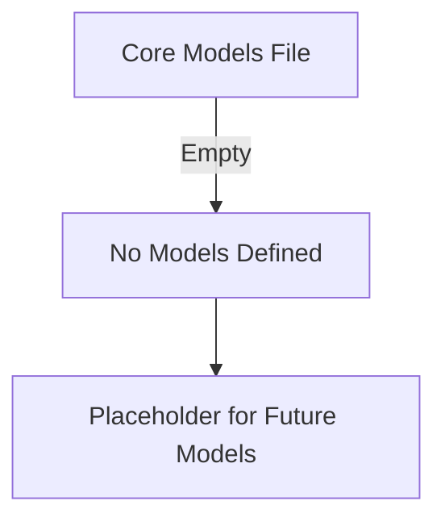

# Core Models Documentation

## 1. Overview
The core module's models file is currently empty and serves as a placeholder for core data models that may be extended in the future.

**Purpose:** To define database models for the core functionality layer.

**Current Status:** Empty - no models defined.

## 2. File Location
- **Source path:** `core/models.py`

## 3. Key Components
Currently, this file contains no classes or functions.

## 4. Execution Flow
This file is imported by Django's ORM system but does not execute any specific logic at this time.

## 5. Data Flow
- **Inputs:** None currently
- **Processing:** None currently
- **Outputs:** None currently
- **Dependencies:** Django ORM models base class (imported but unused)

## 6. Mermaid Diagrams

## 7. Error Handling & Edge Cases
- No error handling required as the file is empty
- No edge cases to consider

## 8. Example Usage
Not applicable.
