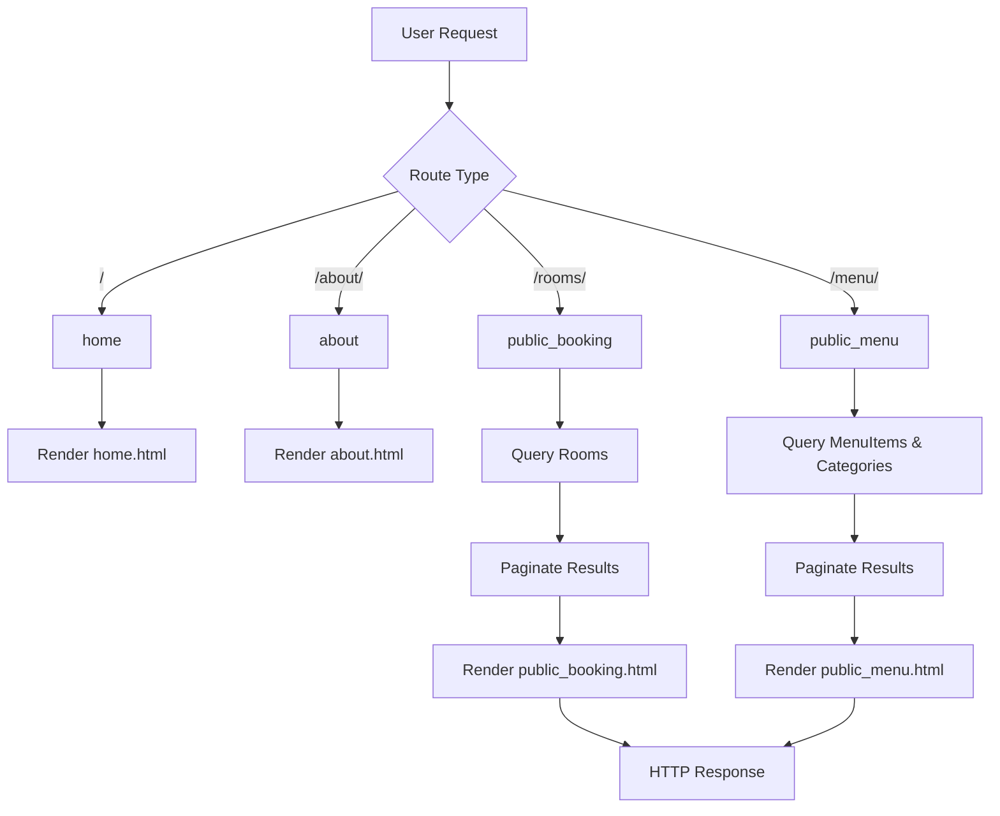
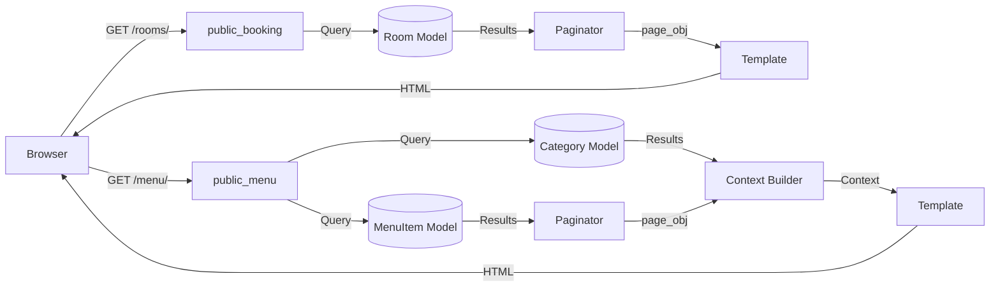

# Core Views Documentation

## 1. Overview
The core module provides public-facing views for the hotel management system. These views serve static pages and handle the public booking/menu display functionality without requiring authentication.

**Purpose:** To render public-facing pages and handle pagination for rooms and menu items.

**Responsibility:** Display home, about, public booking catalog, and public menu with pagination.

## 2. File Location
- **Source path:** `core/views.py`

## 3. Key Components

### Functions

#### `home(request)`
- **Purpose:** Render the home page
- **Parameters:** `request` - HTTP request object
- **Returns:** Rendered template `public/home.html`
- **Authentication:** Not required

#### `about(request)`
- **Purpose:** Render the about page
- **Parameters:** `request` - HTTP request object
- **Returns:** Rendered template `public/about.html`
- **Authentication:** Not required

#### `public_booking(request)` 
- **Purpose:** Display all available rooms with pagination
- **Parameters:** `request` - HTTP request object
- **Returns:** Rendered template `public/public_booking.html` with context
- **Authentication:** Not required
- **Pagination:** 9 rooms per page
- **Context Variables:**
  - `page_obj`: Paginated room objects
  
#### `public_menu(request)`
- **Purpose:** Display all menu items with category filtering and pagination
- **Parameters:** `request` - HTTP request object
- **Returns:** Rendered template `public/public_menu.html` with context
- **Authentication:** Not required
- **Pagination:** 3 items per page
- **Context Variables:**
  - `page_obj`: Paginated menu items
  - `categories`: All categories with related items prefetched

## 4. Execution Flow

```
1. User requests public route
2. View receives HTTP request
3. Database query executed (Room/MenuItem objects)
4. Paginator processes results
5. Template rendered with context
6. HTML response returned to client
```

**Flow for `public_booking(request)`:**
1. Get all Room objects from database
2. Create Paginator with 9 rooms per page
3. Get page number from request.GET
4. Retrieve specific page
5. Render template with page_obj

**Flow for `public_menu(request)`:**
1. Get all MenuItem objects
2. Get all Category objects with prefetch_related optimization
3. Create Paginator with 3 items per page
4. Get page number from request.GET
5. Render template with context

## 5. Data Flow

### Inputs
- HTTP GET request parameters:
  - `page` (optional): Page number for pagination

### Processing
- **Database Queries:**
  - `Room.objects.all()` - Retrieves all rooms
  - `MenuItem.objects.all()` - Retrieves all menu items
  - `Category.objects.prefetch_related('items').all()` - Gets categories with optimized queries

- **Pagination:** Divides results into pages
- **Context Building:** Assembles data for template rendering

### Outputs
- Rendered HTML template with context data
- Status code 200 (success) or 404 (page not found)

### Dependencies
- Django ORM: `Room`, `MenuItem`, `Category` models
- Django Paginator: `Paginator` class
- Django shortcuts: `render`

## 6. Mermaid Diagrams



**Data Flow Diagram:**


## 7. Error Handling & Edge Cases

### Possible Failures
- **Invalid page number:** `Paginator.get_page()` returns last valid page if invalid number provided
- **Empty database:** Returns empty paginated list gracefully
- **Database connection error:** Django ORM will raise `OperationalError`

### Edge Cases
- **First page (no ?page parameter):** Paginator defaults to page 1
- **Non-existent page:** Returns last available page instead of error
- **Zero items:** Paginator creates empty page gracefully
- **Single room/item:** Pagination still works, single page returned

## 8. Example Usage

### Public Booking View
**URL:** `/rooms/` (HTTP GET)

**Response Context:**
```python
{
    'page_obj': <Page 1 of 3>,  # Contains 9 Room objects
}
```

### Public Menu View
**URL:** `/menu/` (HTTP GET)

**Response Context:**
```python
{
    'page_obj': <Page 1 of 5>,  # Contains 3 MenuItem objects
    'categories': [
        Category(name='Appetizers', items=[...]),
        Category(name='Main Courses', items=[...]),
        # ...
    ]
}
```

### Pagination
**Request:** `GET /rooms/?page=2`

**Response:** Shows rooms 10-18 (second page of 9 items)
