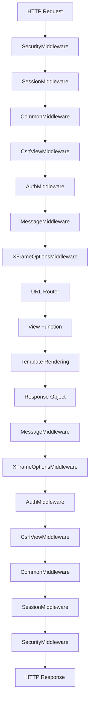
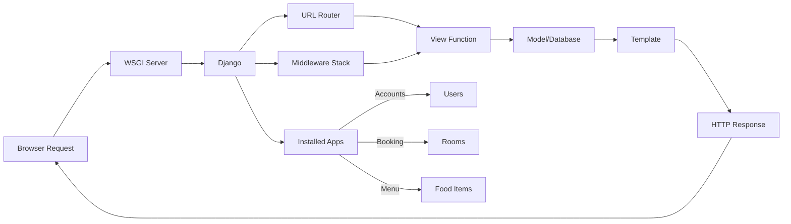
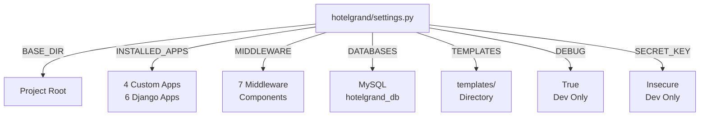

# Django Settings Configuration Documentation

## 1. Overview
The settings module contains all Django configuration for the Hotel Grand project. It defines installed applications, middleware, database configuration, template settings, and security settings for the development environment.

**Purpose:** Centralize Django configuration and environment-specific settings.

**Responsibility:** Configure application components, database connection, templates, security, and middleware behavior.

## 2. File Location
- **Source path:** `hotelgrand/settings.py`

## 3. Key Components

### Project Metadata
**SECRET_KEY:** Django secret key for cryptographic signing
- Value: `'django-insecure-7n80f!if*hc3&g+4bcos5=zaow+zgy@of_#9(d4^zp)nl$2!42'`
- Status: **INSECURE - For development only, must be changed in production**

**DEBUG:** Debug mode flag
- Value: `True`
- Status: **Development only - Must be False in production**

**ALLOWED_HOSTS:** List of allowed hostnames
- Value: `[]` (empty)
- Meaning: In production, must specify allowed domain names

---

### Installed Applications

```python
INSTALLED_APPS = [
    'django.contrib.admin',        # Admin interface
    'django.contrib.auth',         # Authentication system
    'django.contrib.contenttypes', # Content type framework
    'django.contrib.sessions',     # Session framework
    'django.contrib.messages',     # Message framework
    'django.contrib.staticfiles',  # Static file serving
    'menu',                        # Food menu app
    'core',                        # Core app
    'booking',                     # Room booking app
    'accounts',                    # User accounts app
]
```

**Django Built-in Apps:**
- **admin:** Admin interface at /admin/
- **auth:** User authentication and permissions
- **contenttypes:** Content type tracking for models
- **sessions:** User session management
- **messages:** User message display system
- **staticfiles:** Static file collection and serving

**Custom Apps:**
- **menu:** Food ordering functionality
- **core:** Core public views (home, about)
- **booking:** Room reservation system
- **accounts:** User profile management

---

### Middleware

Middleware components process requests/responses in order:

```python
MIDDLEWARE = [
    'django.middleware.security.SecurityMiddleware',           # Security headers
    'django.contrib.sessions.middleware.SessionMiddleware',    # Session support
    'django.middleware.common.CommonMiddleware',               # Common utilities
    'django.middleware.csrf.CsrfViewMiddleware',              # CSRF protection
    'django.contrib.auth.middleware.AuthenticationMiddleware', # User authentication
    'django.contrib.messages.middleware.MessageMiddleware',    # Message framework
    'django.middleware.clickjacking.XFrameOptionsMiddleware',  # Clickjacking protection
]
```

**Order matters:** Top-to-bottom execution on request, bottom-to-top on response

---

### URL Configuration

```python
ROOT_URLCONF = 'hotelgrand.urls'
```

Points to main URL dispatcher in `hotelgrand/urls.py`

---

### Templates Configuration

```python
TEMPLATES = [
    {
        'BACKEND': 'django.template.backends.django.DjangoTemplates',
        'DIRS': [os.path.join(BASE_DIR, 'templates')],
        'APP_DIRS': True,
        'OPTIONS': {
            'context_processors': [
                'django.template.context_processors.debug',
                'django.template.context_processors.request',
                'django.contrib.auth.context_processors.auth',
                'django.contrib.messages.context_processors.messages',
            ],
        },
    },
]
```

**Configuration:**
- **BACKEND:** Uses Django's template engine
- **DIRS:** Template directory at project root: `BASE_DIR/templates`
- **APP_DIRS:** Also looks in each app's templates/ folder
- **context_processors:** Functions that add variables to template context:
  - `debug`: DEBUG flag
  - `request`: HTTP request object
  - `auth`: User and permission objects
  - `messages`: Message framework

---

### Database Configuration

```python
DATABASES = {
    'default': {
        'ENGINE': 'django.db.backends.mysql',
        'NAME': 'hotelgrand_db',
        'USER': 'django_user',
        'PASSWORD': 'secure_password',
        'HOST': 'localhost',
        'PORT': '3306',
    }
}
```

**Database Settings:**
- **ENGINE:** MySQL database backend
- **NAME:** Database name: `hotelgrand_db`
- **USER:** MySQL user: `django_user`
- **PASSWORD:** Database password (should be in environment variable in production)
- **HOST:** localhost (local machine)
- **PORT:** 3306 (MySQL default)

**Connection Requirements:**
- MySQL server running on localhost
- `hotelgrand_db` database created
- User `django_user` with password `secure_password` created

---

### Base Directory

```python
BASE_DIR = Path(__file__).resolve().parent.parent
```

**Calculation:**
- Current file: `hotelgrand/settings.py`
- .parent: `hotelgrand/`
- .parent.parent: Project root (where manage.py is)

---

### WSGI Application

```python
WSGI_APPLICATION = 'hotelgrand.wsgi.application'
```

Points to WSGI callable in `hotelgrand/wsgi.py` for production server deployment

---

## 4. Execution Flow

**Django Startup Sequence:**
```
1. Django loads settings.py
2. BASE_DIR calculated
3. Middleware instantiated in order
4. Installed apps initialized
5. URL patterns loaded from ROOT_URLCONF
6. Database connection established (lazy on first query)
7. Application ready to handle requests
```

**Request Processing with Middleware:**
```
Request → SecurityMiddleware → SessionMiddleware → ... → CsrfMiddleware → AuthMiddleware → View Function
View Response → MessageMiddleware → CsrfMiddleware → ... → SecurityMiddleware → Browser
```

## 5. Data Flow

### Inputs
- Django start command: `python manage.py runserver`
- Environment variables (potential for credentials)
- Configuration values in settings.py

### Processing
- Settings validation on startup
- Middleware loading
- App initialization
- Database connection (lazy)

### Outputs
- Configured Django application
- Active middleware stack
- Database connection ready
- URL patterns loaded

### Dependencies
- Python pathlib (Path)
- Django core
- MySQL backend
- Individual app configurations

## 6. Mermaid Diagrams

**Django Request/Response Cycle with Middleware:**


**Django Application Architecture:**


**Configuration Hierarchy:**


## 7. Error Handling & Edge Cases

### Possible Failures
- **Database not running:** OperationalError on first DB query
- **Database credentials wrong:** MySQL connection refused
- **Missing templates directory:** TemplateDoesNotExist error
- **App import error:** ImproperlyConfigured exception
- **DEBUG=True in production:** Security vulnerability
- **ALLOWED_HOSTS empty:** DisallowedHost exception in production

### Edge Cases
- **Circular imports between apps:** RuntimeError on startup
- **Missing installed app:** Model registration fails
- **Middleware order wrong:** Unexpected behavior (e.g., CSRF before sessions)
- **context_processors removed:** Variables unavailable in templates
- **Multiple TEMPLATES backends:** Last one used (or explicitly selected)

## 8. Example Usage

### Adding New Installed App
```python
INSTALLED_APPS = [
    # ... existing apps ...
    'new_app_name',  # Add new custom app
]

# Then run migrations:
# python manage.py makemigrations
# python manage.py migrate
```

### Adding Middleware
```python
MIDDLEWARE = [
    # ... existing middleware ...
    'path.to.CustomMiddleware',  # Add new middleware
]

# Order matters! Add before view reaches certain middleware
```

### Changing Database
```python
DATABASES = {
    'default': {
        'ENGINE': 'django.db.backends.postgresql',
        'NAME': 'mydb',
        'USER': 'myuser',
        'PASSWORD': os.environ.get('DB_PASSWORD'),  # From environment
        'HOST': 'db.example.com',
        'PORT': '5432',
    }
}
```

### Environment-Specific Settings
```python
import os

DEBUG = os.environ.get('DEBUG', 'False') == 'True'
SECRET_KEY = os.environ.get('SECRET_KEY')
ALLOWED_HOSTS = os.environ.get('ALLOWED_HOSTS', 'localhost').split(',')
```

### Static Files Configuration
```python
# Settings addition
STATIC_URL = '/static/'
STATIC_ROOT = os.path.join(BASE_DIR, 'staticfiles')
STATICFILES_DIRS = [
    os.path.join(BASE_DIR, 'static'),
]

# Collect static files:
# python manage.py collectstatic
```

### Media Files Configuration
```python
# Settings addition
MEDIA_URL = '/media/'
MEDIA_ROOT = os.path.join(BASE_DIR, 'media')

# In urls.py for development:
from django.conf import settings
from django.conf.urls.static import static

urlpatterns = [...]
if settings.DEBUG:
    urlpatterns += static(settings.MEDIA_URL, document_root=settings.MEDIA_ROOT)
```
