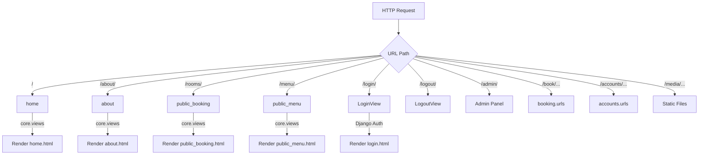
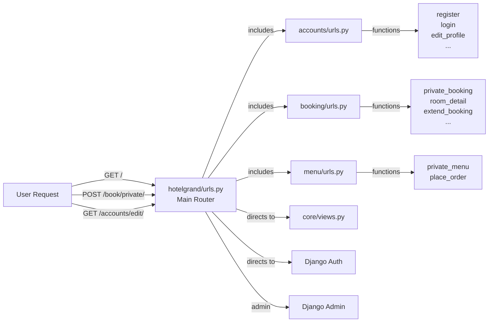
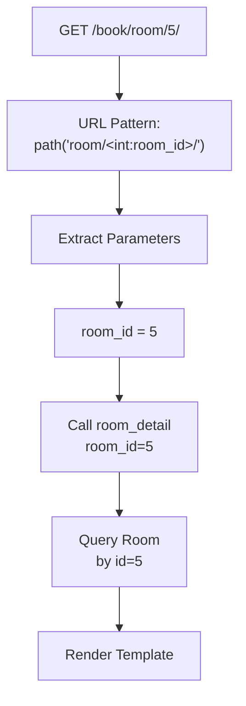

# Project URLs Configuration Documentation

## 1. Overview
The main URL configuration routes all HTTP requests to appropriate application views. It serves as the central dispatcher for the Hotel Grand project, directing requests to accounts, booking, menu, and core functionality endpoints.

**Purpose:** Define and route all application URLs to corresponding views and apps.

**Responsibility:** Map URL patterns to views, serve static/media files in development, manage authentication routes.

## 2. File Location
- **Source path:** `hotelgrand/urls.py`

## 3. Key Components

### Admin Panel
```
Path: admin/
View: admin.site.urls (Django's built-in admin)
Method: GET/POST
Purpose: Django admin interface for database management
Authentication: Superuser required
```

---

### Public Home & Info
```
Path: /
View: core.views.home
Name: 'home'
Method: GET
Purpose: Display home page
Authentication: Not required
```

```
Path: about/
View: core.views.about
Name: 'about'
Method: GET
Purpose: Display about page
Authentication: Not required
```

---

### Public Booking Display
```
Path: rooms/
View: core.views.public_booking
Name: 'public_booking'
Method: GET
Purpose: Display available rooms catalog
Authentication: Not required
Pagination: 9 rooms per page
```

---

### Public Menu Display
```
Path: menu/
View: core.views.public_menu
Name: 'public_menu'
Method: GET
Purpose: Display public menu with categories
Authentication: Not required
Pagination: 3 items per page
```

---

### Authentication Routes
```
Path: login/
View: django.contrib.auth.views.LoginView
Name: 'login'
Method: GET/POST
Purpose: User login
Template: shared/login.html
```

```
Path: logout/
View: django.contrib.auth.views.LogoutView
Name: 'logout'
Method: GET/POST
Purpose: User logout (redirects to login)
Next Page: 'login'
```

---

### Booking App Routes
```
Path: book/
Include: booking.urls
Methods: Various
Purpose: All booking operations (private booking, availability, extensions, reviews)
Authentication: Varies by endpoint
Sub-patterns:
  - book/private/: Private booking for authenticated users
  - book/check/: Availability checking
  - book/booking/success/: Confirmation page
  - book/room/<id>/: Room detail page
  - book/extend-booking/: Booking extension
  - book/submit-review/: Review submission
```

---

### Accounts App Routes
```
Path: accounts/
Include: accounts.urls
Methods: Various
Purpose: User account management
Sub-patterns:
  - accounts/register/: User registration
  - accounts/login/: User login (custom)
  - accounts/edit/: Profile editing
  - accounts/update/username/: Update username
  - accounts/update/email/: Update email
  - accounts/update/photo/: Upload profile picture
  - accounts/update/password/: Change password
  - accounts/update/details/: Update personal info
```

---

### Menu App Routes
```
Path: menu/
Include: menu.urls
Methods: Various
Purpose: Menu browsing and ordering
Sub-patterns:
  - menu/private-menu/: Private menu for checked-in guests
  - menu/place-order/: Place food order
```

---

### Static & Media Files (Development Only)
```python
if settings.DEBUG:
    urlpatterns += static(settings.MEDIA_URL, document_root=settings.MEDIA_ROOT)
```

**Purpose:** Serve user-uploaded files (profile images, room images) in development
- Media URL path: `/media/`
- Media root directory: `BASE_DIR/media`
- Includes:
  - profile_images/: User profile pictures
  - room_images/: Room photos
  - menu_images/: Menu item pictures

**Note:** In production, static/media files served by nginx/Apache, not Django

---

## 4. Execution Flow

**URL Resolution Process:**
```
1. User makes HTTP request to /path/
2. Django URL dispatcher receives request
3. URL patterns checked in order from top to bottom
4. First matching pattern selected
5. View function called with request and URL parameters
6. View returns response
7. Response returned to user
```

**Request Flow Examples:**

**Example 1: Access Home Page**
```
GET / → Matches path('', views.home) → core.views.home() → Rendered home.html
```

**Example 2: User Login**
```
GET /login/ → Matches path('login/', LoginView) → Django LoginView → Rendered login.html
```

**Example 3: Book Room**
```
POST /book/private/ → Matches include("booking.urls") → booking.urls patterns → booking.views.private_booking()
```

**Example 4: Media File (Development)**
```
GET /media/profile_images/user123.jpg → Matches static() pattern → Django FileResponse → Image file
```

---

## 5. Data Flow

### Inputs
- HTTP request path
- Request method (GET, POST, etc.)
- URL parameters (e.g., `<room_id>`)
- Query string parameters

### Processing
- Pattern matching against urlpatterns list
- URL parameter extraction
- View function/class selection
- Parameters passed to view
- Decorators applied (login_required, etc.)

### Outputs
- View function/class response
- HTTP status code (200, 404, 302, etc.)
- Response headers
- Response body (HTML, JSON, redirect)

### Dependencies
- django.contrib.admin
- django.contrib.auth views
- Django URL routing system
- Each app's urls.py module
- Django's static file handler

---

## 6. Mermaid Diagrams

**URL Routing Map:**


**Application Architecture:**


**URL Parameter Extraction:**


---

## 7. Error Handling & Edge Cases

### Possible Failures
- **Invalid URL:** No matching pattern → 404 Not Found
- **Missing view function:** ImportError on startup
- **Trailing slash mismatch:** Depends on APPEND_SLASH setting
- **URL parameter type mismatch:** 404 (e.g., `<int:id>` with non-integer)
- **Include() without slash:** Pattern matching issues

### Edge Cases
- **Overlapping patterns:** First match wins (order matters!)
- **Regex special characters:** Must be escaped in path strings
- **Very long URLs:** No built-in limit (server dependent)
- **Special characters in parameters:** URL encoding required
- **Dynamic pattern matching:** `<slug:page_slug>` matches "my-page"
- **Multiple URL parameters:** `<int:user_id>/<int:post_id>/` supported
- **Optional parameters:** Not supported in path(); use query strings instead

---

## 8. Example Usage

### Access Home Page
**URL:** `/`
**HTTP Method:** GET
**View:** `core.views.home()`
**Response:** Rendered home page

### User Registration
**URL:** `/accounts/register/`
**HTTP Method:** POST
**View:** `accounts.views.register()`
**Form Data:** username, email, password1, password2
**Response:** JSON success/error

### Book Private
**URL:** `/book/private/`
**HTTP Method:** GET/POST
**View:** `booking.views.private_booking()`
**Parameters (POST):** room_id, check_in, check_out, guest_count
**Response:** Rendered booking page or redirect

### View Room Details
**URL:** `/book/room/3/`
**HTTP Method:** GET
**View:** `booking.views.room_detail(room_id=3)`
**Response:** Room details with reviews and images

### Place Food Order
**URL:** `/menu/place-order/`
**HTTP Method:** POST
**View:** `menu.views.place_order()`
**Form Data:** item_id, quantity
**Response:** Redirect with message

### Login
**URL:** `/login/`
**HTTP Method:** GET/POST
**View:** Django's built-in LoginView
**Template:** shared/login.html
**Redirect After:** Defined by next parameter or LOGIN_REDIRECT_URL

### Logout
**URL:** `/logout/`
**HTTP Method:** GET/POST
**View:** Django's built-in LogoutView
**Redirect After:** Login page

### Admin Interface
**URL:** `/admin/`
**HTTP Method:** GET/POST
**View:** Django Admin site
**Authentication:** Superuser only

### Media File Access (Development)
**URL:** `/media/profile_images/john_doe.jpg`
**HTTP Method:** GET
**Response:** Image file from media/profile_images/
**Note:** Only in DEBUG=True; use separate server in production

### Reverse URL Lookup in Code
```python
from django.urls import reverse

# Get URL from view name
home_url = reverse('home')  # Returns: /
login_url = reverse('login')  # Returns: /login/
room_url = reverse('room_detail', args=[5])  # Returns: /book/room/5/
```

### Include URL Patterns
```python
# Main urls.py
from django.urls import path, include

urlpatterns = [
    path('book/', include('booking.urls')),  # All booking URLs prefixed with /book/
    path('accounts/', include('accounts.urls')),  # All account URLs prefixed with /accounts/
]

# Results in:
# /book/private/ (from booking.urls)
# /accounts/register/ (from accounts.urls)
```
