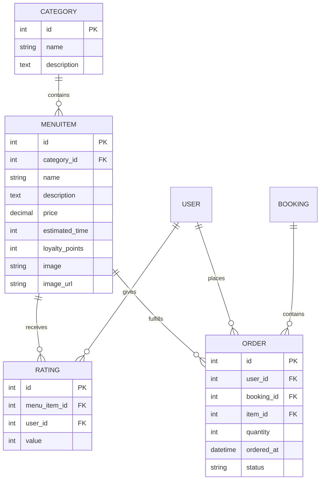
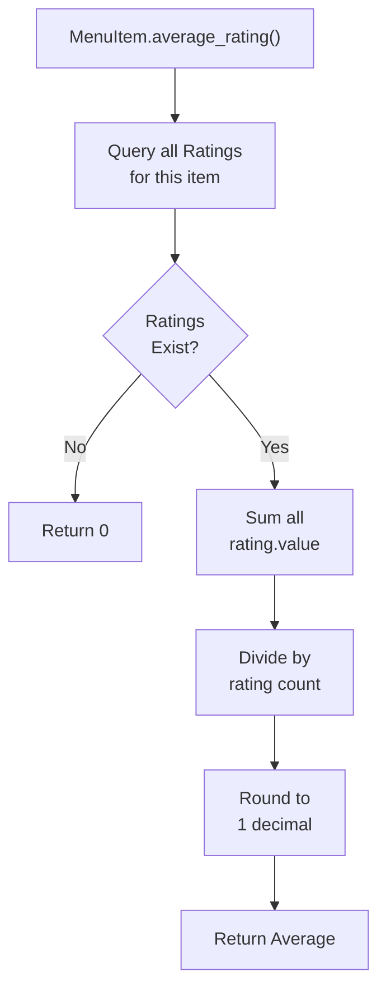

# Menu Models Documentation

## 1. Overview

The menu module manages the hotel's food service catalog including menu items, categories, ratings, and guest food orders. It enables guests to browse, rate menu items, and place food orders during their stay.

**Purpose:** Define data structures for restaurant menu management and food ordering system.

**Responsibility:** Store menu items, categories, user ratings, and food orders with associated metadata.

## 2. File Location

- **Source path:** `menu/models.py`

## 3. Key Components

### Class: `Category`

**Purpose:** Organize menu items into logical groupings

#### Fields

- **`name`** (CharField) - Max 50, category identifier (e.g., "Appetizers", "Main Courses")
- **`description`** (TextField) - Optional category description

#### Methods

**`__str__()`** - Returns category name

#### Relationships

- Has many MenuItem objects via related_name='items'

---

### Class: `MenuItem`

**Purpose:** Represent individual food items on the menu with pricing and metadata

#### Fields

- **`name`** (CharField) - Max 100, dish name
- **`category`** (ForeignKey) - Links to Category, null allowed, cascade delete, related_name='items'
- **`description`** (TextField) - Optional dish description
- **`price`** (DecimalField) - Max 6 digits, 2 decimal places (e.g., 9999.99)
- **`estimated_time`** (PositiveIntegerField) - Preparation time in minutes
- **`loyalty_points`** (PositiveIntegerField) - Default: 0, reward points earned
- **`image`** (ImageField) - Upload path: menu_images/, optional
- **`image_url`** (URLField) - Optional external image URL

#### Methods

**`average_rating()`**

- **Purpose:** Calculate average rating for menu item
- **Returns:** Decimal number rounded to 1 decimal place (e.g., 4.3)
- **Logic:**
  1. Query all Rating objects for this item
  2. If none exist: return 0
  3. If exist: Sum all rating values / count of ratings
  4. Round to 1 decimal place
- **Edge Case:** Returns 0 if no ratings exist (division by zero protection)

**`__str__()`** - Returns item name

#### Relationships

- Has many Rating objects via related_name='ratings'
- Belongs to one Category (optional)

---

### Class: `Rating`

**Purpose:** Store user ratings for menu items

#### Fields

- **`menu_item`** (ForeignKey) - Links to MenuItem, cascade delete, related_name='ratings'
- **`user`** (ForeignKey) - Links to User, cascade delete
- **`value`** (PositiveSmallIntegerField) - Rating value (typically 1-5)

#### Methods

**`__str__()`** - Returns format: "{username} rated {menu_item} → {value}"

#### Relationships

- Belongs to one MenuItem
- Belongs to one User
- Combined: Prevents duplicate ratings for same user/item pair (though not enforced at model level)

---

### Class: `Order`

**Purpose:** Track food orders placed by guests during their stay

#### Fields

- **`user`** (ForeignKey) - Links to User (guest), cascade delete
- **`booking`** (ForeignKey) - Links to Booking (room reservation), cascade delete
- **`item`** (ForeignKey) - Links to MenuItem ordered, cascade delete
- **`quantity`** (PositiveIntegerField) - Default: 1, units ordered
- **`ordered_at`** (DateTimeField) - Auto-set on creation
- **`status`** (CharField) - Default: "pending" (pending, preparing, delivered)

#### Methods

**`__str__()`** - Returns format: "{username} ordered {item_name}"

#### Relationships

- Belongs to one User (guest)
- Belongs to one Booking (associated room reservation)
- Belongs to one MenuItem
- Allows multiple orders per user/booking
- Links orders to specific room reservations

---

## 4. Execution Flow

**Menu Item Display Flow:**

```
1. User navigates to menu page
2. View queries all MenuItem objects
3. Pagination divides into pages (3 items per page)
4. For each item: average_rating() called to compute score
5. Template renders items with ratings
```

**Order Placement Flow:**

```
1. User selects menu item and quantity
2. Check if user has active booking with status="checked_in"
3. Create Order object:
   - Link to user
   - Link to booking
   - Link to item
   - Set quantity
   - Set status = "pending"
4. Save to database
5. Show confirmation
```

**Rating Submission Flow:**

```
1. User views menu item detail
2. User submits rating (1-5 stars)
3. Create Rating object:
   - Link to menu_item
   - Link to user
   - Set value
4. Save to database
5. Next view: average_rating() recalculates using new rating
```

## 5. Data Flow

### Inputs

**MenuItem Creation:**

- name, description, price, estimated_time, loyalty_points
- image (file) or image_url

**Order Creation:**

- user_id, booking_id, item_id, quantity

**Rating Submission:**

- menu_item_id, user_id, value (1-5)

### Processing

- **Aggregation:** Average rating calculated on-demand per item
- **Status Tracking:** Orders tracked through preparation states
- **Relationships:** Foreign keys maintain data integrity
- **Cascading:** Deleting category/item deletes related orders/ratings

### Outputs

- MenuItem records with average ratings
- Order records linked to bookings and users
- Rating records associated with users and items

### Dependencies

- Django ORM models
- Category → MenuItem hierarchy
- User → Rating relationship for tracking user preferences
- Booking → Order relationship for order context

## 6. Mermaid Diagrams

**Entity Relationship Diagram:**



**Rating Aggregation Flow:**



## 7. Error Handling & Edge Cases

### Possible Failures

- **No category for item:** Allowed (category can be null)
- **Price validation:** DecimalField auto-validates precision
- **Duplicate rating:** Model doesn't prevent (view should handle)
- **Order for non-checked-in user:** View prevents (model doesn't)
- **Negative quantity:** PositiveIntegerField prevents at model level

### Edge Cases

- **Zero ratings:** average_rating() returns 0 gracefully
- **Item without image:** Can use image_url instead
- **No average_rating yet:** Returns 0 before first rating
- **Order quantity zero:** PositiveIntegerField requires >= 1
- **Category deleted:** MenuItem.category becomes orphaned (if null not enforced)
- **User deletes account:** All related ratings/orders cascade deleted
- **Multiple orders same item, same booking:** Allowed (no uniqueness constraint)

## 8. Example Usage

### Creating Menu Structure

```python
from menu.models import Category, MenuItem

# Create category
appetizers = Category.objects.create(
    name="Appetizers",
    description="Starters and small plates"
)

# Create menu item
calamari = MenuItem.objects.create(
    name="Fried Calamari",
    category=appetizers,
    description="Crispy fried squid with lemon aioli",
    price=12.99,
    estimated_time=15,
    loyalty_points=10,
    image_url="https://example.com/calamari.jpg"
)

# Access related items
all_appetizers = appetizers.items.all()  # Related query
calamari_rating = calamari.average_rating()  # Returns: 4.5
```

### Placing an Order

```python
from menu.models import Order, MenuItem
from booking.models import Booking

user = request.user
item = MenuItem.objects.get(id=5)
booking = Booking.objects.get(guest_name=user.username, status="checked_in")

order = Order.objects.create(
    user=user,
    booking=booking,
    item=item,
    quantity=2,
    status="pending"
)

print(str(order))  # "john_doe ordered Fried Calamari"
```

### Submitting a Rating

```python
from menu.models import Rating, MenuItem

item = MenuItem.objects.get(id=5)
user = request.user

rating = Rating.objects.create(
    menu_item=item,
    user=user,
    value=5  # 5 stars
)

# Recalculate average
avg = item.average_rating()  # Updates with new rating
```

### Querying Orders by Status

```python
from menu.models import Order

# All pending orders
pending = Order.objects.filter(status="pending")

# Get orders for specific user
user_orders = Order.objects.filter(user=request.user)

# Get orders for specific booking
booking_orders = Order.objects.filter(booking=booking_obj)

# Update status
pending.update(status="delivering")
```

### Getting Menu Items with Ratings

```python
from menu.models import MenuItem

items = MenuItem.objects.all()

for item in items:
    print(f"{item.name}: {item.average_rating()} stars")
    # "Fried Calamari: 4.3 stars"
    # "Caesar Salad: 4.8 stars"
```
