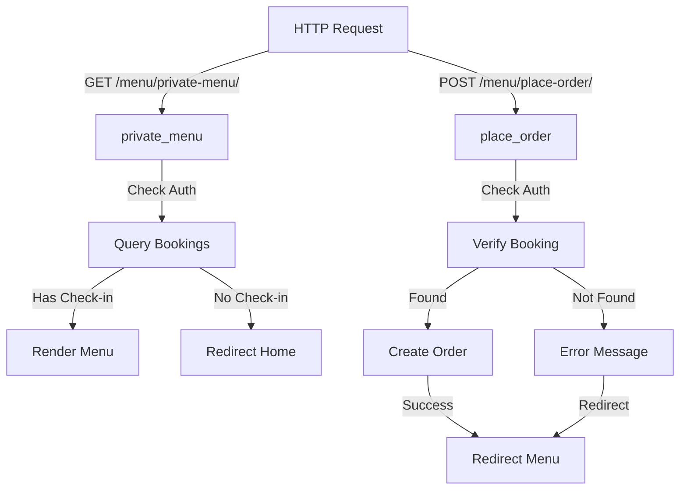

# Menu URLs Configuration Documentation

## 1. Overview
The menu URL configuration defines routing endpoints for food menu browsing and order placement. It maps user requests to menu-related view functions for both public menu display and private guest ordering.

**Purpose:** Route menu and order-related requests to appropriate view functions.

**Responsibility:** Connect URL patterns to menu views for guest food ordering functionality.

## 2. File Location
- **Source path:** `menu/urls.py`

## 3. Key Components

### URL Patterns

#### Private Menu Access
```
Path: menu/private-menu/
View: private_menu
Name: 'private_menu'
Method: GET
Purpose: Display menu for authenticated guests with active bookings
Required Auth: Yes (login_required in view)
Template: customer/private_menu.html
```

#### Place Order
```
Path: menu/place-order/
View: place_order
Name: 'place_order'
Method: POST
Purpose: Submit food order for checked-in guest
Required Auth: Yes (login_required in view)
Response: Redirect with message
```

## 4. Execution Flow

**URL Resolution:**
```
1. Request arrives at /menu/private-menu/ or /menu/place-order/
2. Django URL router matches against urlpatterns
3. Associated view function identified and called
4. View processes request with decorators applied
5. Response returned (template or redirect)
```

**Request Flow for Private Menu:**
```
Browser → /menu/private-menu/ → URL Router → private_menu view → Check auth → Query bookings → Render template → HTML response
```

**Request Flow for Order Placement:**
```
Form Submit → POST /menu/place-order/ → URL Router → place_order view → Check auth → Verify booking → Create Order → Redirect with message
```

## 5. Data Flow

### Inputs
- URL path patterns
- HTTP method (GET for private_menu, POST for place_order)
- Request parameters from forms

### Processing
- URL pattern matching
- View function selection
- Decorator execution (login_required)
- View logic execution

### Outputs
- HTTP response from view
- Template rendering or redirect
- Messages displayed to user

### Dependencies
- Django URL routing system
- menu.views module functions
- Authentication system (login_required)

## 6. Mermaid Diagrams

**URL Routing:**


## 7. Error Handling & Edge Cases

### Possible Failures
- **Invalid URL:** Django returns 404 Not Found
- **Missing view function:** ImportError at startup
- **User not authenticated:** Decorator redirects to login

### Edge Cases
- **URL name conflicts:** Last definition wins
- **Special characters in URL:** Must be properly encoded
- **Case sensitivity:** URL paths are case-sensitive

## 8. Example Usage

### Reverse URL Lookup
```python
from django.urls import reverse

url = reverse('private_menu')  # /menu/private-menu/
url = reverse('place_order')   # /menu/place-order/
```

### Template Links
```django
<!-- Menu link -->
<a href="">View Menu</a>

<!-- Order form -->
<form method="POST" action="">
    
    <input type="hidden" name="item_id" value="{{ item.id }}">
    <input type="number" name="quantity" value="1">
    <button type="submit">Place Order</button>
</form>
```

### URL Inclusion in Main Project
```python
# hotelgrand/urls.py
from django.urls import path, include

urlpatterns = [
    path('menu/', include('menu.urls')),  # Mounts /menu/ prefix
]

# Results in:
# /menu/private-menu/
# /menu/place-order/
```
