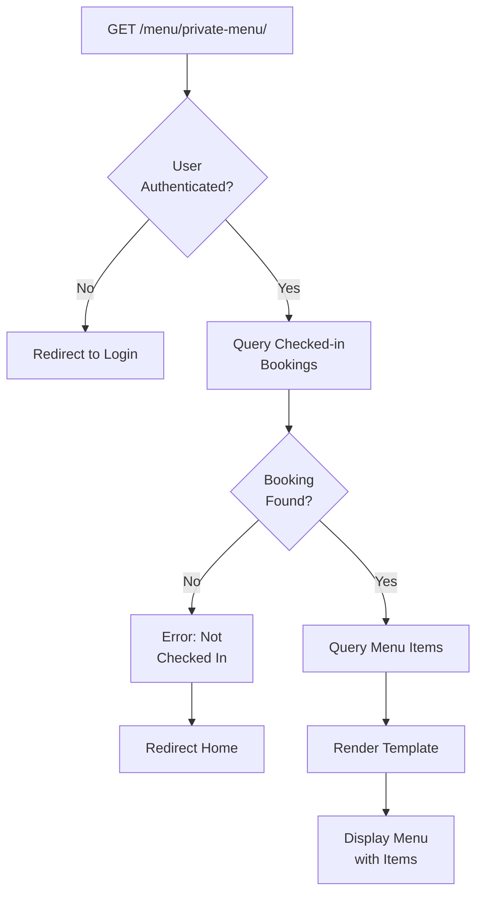
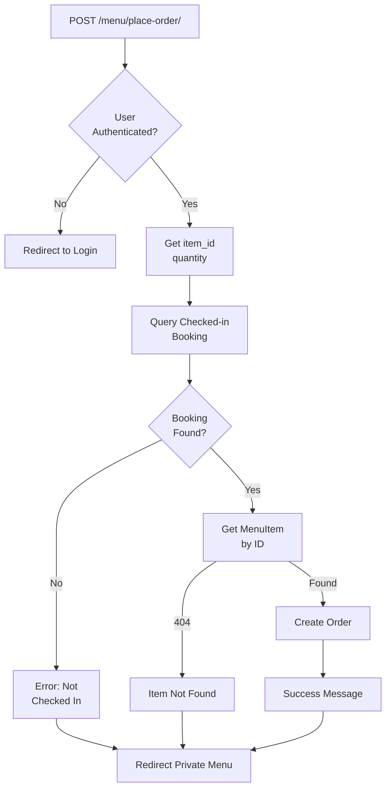
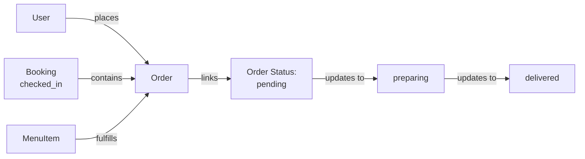

# Menu Views Documentation

## 1. Overview

The menu views module provides endpoints for browsing and ordering food items. It handles both public menu display with pagination and private (authenticated) menu ordering for guests with active check-ins.

**Purpose:** Display restaurant menu and process food orders from guests.

**Responsibility:** Render menu pages, manage order placement, enforce authentication requirements for ordering.

## 2. File Location

- **Source path:** `menu/views.py`

## 3. Key Components

### Function: `private_menu(request)` - [Login Required]

**Purpose:** Display menu exclusively to guests with active room bookings (checked-in)

**HTTP Methods:** GET

**Decorators:** @login_required

**Process:**

1. Query Booking model for user's checked-in bookings:
   - Filter by guest_name = request.user.username
   - Filter by status = "checked_in"
   - Order by check_in descending (most recent first)
   - Get first result or None
2. If no checked-in booking:
   - Display error message: "You must be checked in to access the private menu"
   - Redirect to home page
3. If booking found:
   - Query all MenuItem objects
   - Render template with items and booking context
   - Allow user to place orders

**Returns:**

- Rendered template `customer/private_menu.html` with context
- OR redirect to home if not checked in

**Context:**

- `items`: QuerySet of all MenuItem objects
- `booking`: Booking object for current user's check-in

**Access Control:** Requires:

- User to be authenticated (login_required)
- User to have active checked-in booking

---

### Function: `place_order(request)` - [Login Required]

**Purpose:** Create food order for guest with active booking

**HTTP Methods:** POST

**Decorators:** @login_required

**POST Parameters:**

- `item_id`: ID of MenuItem to order
- `quantity`: Number of items to order (default: 1)

**Process:**

1. Extract POST data: item_id, quantity
2. Query Booking for user's current checked-in reservation:
   - Filter by guest_name = request.user.username
   - Filter by status = "checked_in"
   - Order by check_in descending
   - Get first result
3. If no checked-in booking:
   - Display error message: "You must be checked in to place an order"
   - Redirect to private_menu
4. If booking found:
   - Get MenuItem by item_id (404 if not found)
   - Create Order object:
     - user = request.user
     - booking = found booking
     - item = found menu item
     - quantity = converted to int
   - Display success message with item name
   - Redirect to private_menu

**Returns:**

- Redirect to private_menu with success/error message

**Error Scenarios:**

- No checked-in booking: Error message, redirect to private_menu
- MenuItem not found: 404 via get_object_or_404()
- Invalid quantity format: May cause ValueError (not caught)

---

## 4. Execution Flow

**Private Menu Access Flow:**

```
1. Authenticated user navigates to /menu/private-menu/
2. View queries for user's checked-in bookings
3. If no booking with status="checked_in":
   a. Display error message
   b. Redirect to home
4. If booking found:
   a. Query all menu items
   b. Build context with items and booking
   c. Render private_menu.html
5. User sees menu with order buttons
```

**Order Placement Flow:**

```
1. User submits order form (item_id, quantity)
2. POST to /menu/place-order/
3. Verify user has checked-in booking
4. Get MenuItem by ID
5. Create Order record with:
   - user = request.user
   - booking = checked-in booking
   - item = selected item
   - quantity = form value
6. Display success message: "Ordered {item.name} successfully"
7. Redirect back to private_menu
```

**Access Control Logic:**

```
Private Menu:
  Require: login_required decorator
  AND: guest_name == request.user.username
  AND: status == "checked_in"

Place Order:
  Require: login_required decorator
  AND: guest_name == request.user.username
  AND: status == "checked_in"
  AND: valid item_id
```

## 5. Data Flow

### Inputs

**private_menu(GET):**

- Authenticated user session

**place_order(POST):**

- item_id (integer)
- quantity (integer, optional, default 1)

### Processing

- **Booking Query:** Filter active check-ins for current user
- **Access Validation:** Verify user has room reservation
- **Order Creation:** Create Order linking user → booking → item
- **Quantity Handling:** Convert string to integer

### Outputs

- Rendered menu template for private_menu
- Created Order record for place_order
- Redirect responses with message display
- Session-based error/success messages

### Dependencies

- Booking model (check checked-in status)
- MenuItem model (display and order items)
- Order model (create orders)
- User model (linked via request.user)
- Django auth (login_required decorator)
- Django messages framework

## 6. Mermaid Diagrams

**Private Menu Access Flow:**



**Order Placement Flow:**



**Database Relationship:**



## 7. Error Handling & Edge Cases

### Possible Failures

- **User not authenticated:** login_required handles redirect
- **No active booking:** Error message shown, redirect to home/menu
- **MenuItem not found:** 404 via get_object_or_404()
- **Invalid quantity (non-numeric):** int() conversion may raise ValueError (not caught)
- **Quantity of 0:** Allowed by Order model (no validation)

### Edge Cases

- **Multiple checked-in bookings:** Query.first() returns most recent by check_in
- **No menu items available:** Shows empty menu page gracefully
- **User checked out between queries:** Order created but booking status changed (inconsistent)
- **Same item ordered multiple times:** Creates separate Order records (allowed)
- **Very large quantity:** No maximum validation, allowed
- **Order created at exact checkout time:** Edge case, order still created
- **User changes username:** guest_name is static, won't match new username

## 8. Example Usage

### Accessing Private Menu

**URL:** `GET /menu/private-menu/` [Requires Login]

**User State:**

- Must be logged in
- Must have Booking with status="checked_in"

**Response:**

```
Template: customer/private_menu.html
Context: {
    'items': <QuerySet [MenuItem1, MenuItem2, ...]>,
    'booking': <Booking: Room 5 (checked_in)>
}
```

### Placing an Order

**Endpoint:** `POST /menu/place-order/` [Requires Login]

**Request Form Data:**

```
item_id=3
quantity=2
```

**Response:**

- Redirect to `/menu/private-menu/`
- Message: "✅ Ordered Fried Calamari successfully!"

**Created Data:**

```python
Order.objects.filter(user=request.user).latest('ordered_at')
# Order(
#     user=<User: alice>,
#     booking=<Booking: Room 3>,
#     item=<MenuItem: Fried Calamari>,
#     quantity=2,
#     status='pending'
# )
```

### Error Scenarios

**Scenario 1: Not Checked In**

```
User tries to access /menu/private-menu/
No Booking found with status="checked_in"
Error: "❌ You must be checked in to access the private menu."
Redirected to: home page
```

**Scenario 2: Order Without Check-in**

```
POST to /menu/place-order/
No Booking found with status="checked_in"
Error: "❌ You must be checked in to place an order."
Redirected to: /menu/private-menu/
```

**Scenario 3: Item Not Found**

```
POST to /menu/place-order/ with item_id=999
MenuItem with id=999 doesn't exist
Response: 404 Not Found
```

### Template Integration

```django
<!-- private_menu.html -->
<div>
    <h2>Menu - Room {{ booking.room.name }}</h2>

    
        <div class="menu-item">
            <h3>{{ item.name }}</h3>
            <p>{{ item.description }}</p>
            <p>Price: ${{ item.price }}</p>
            <p>Rating: {{ item.average_rating }}/5</p>

            <form method="POST" action="">
                
                <input type="hidden" name="item_id" value="{{ item.id }}">
                <input type="number" name="quantity" value="1" min="1">
                <button type="submit">Order</button>
            </form>
        </div>
    
</div>
```
